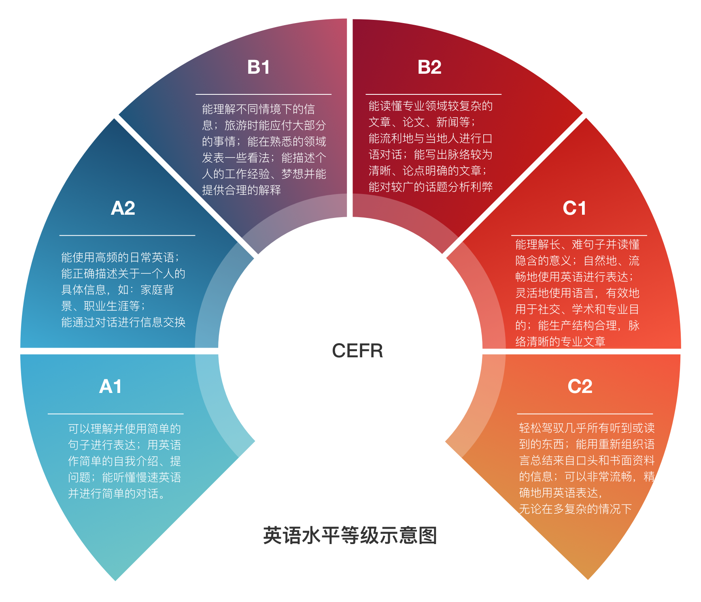
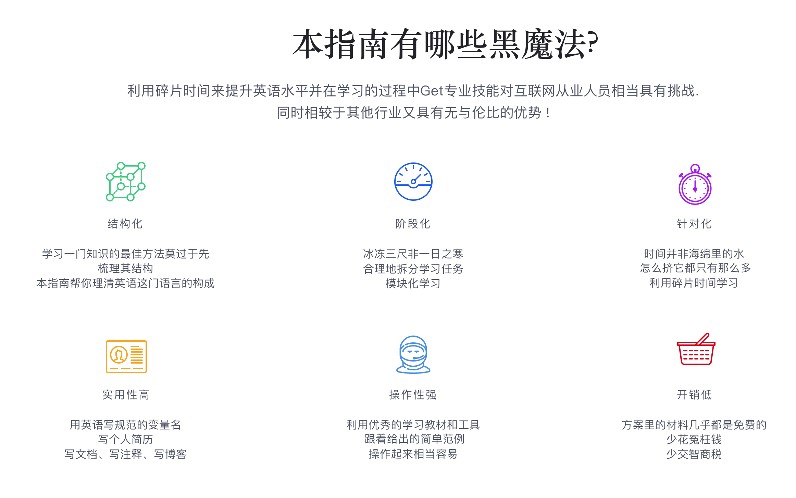
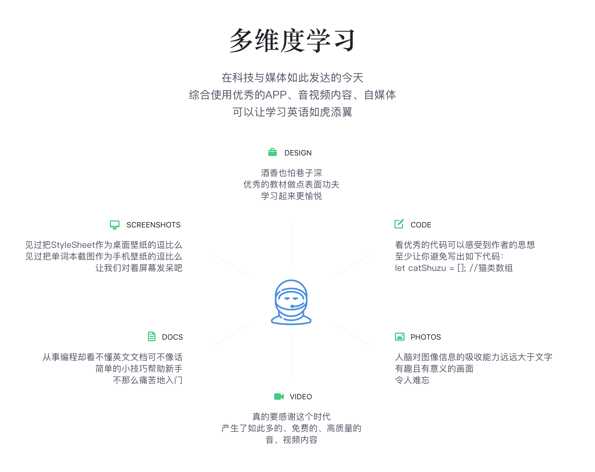
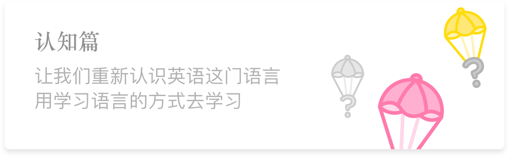
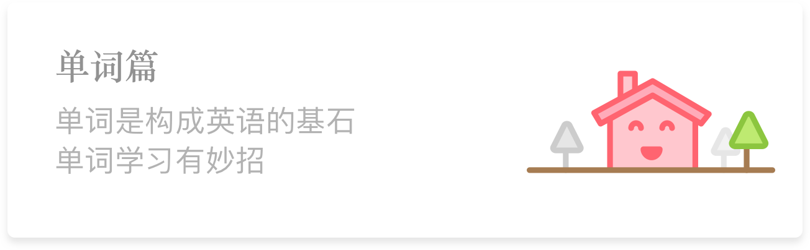
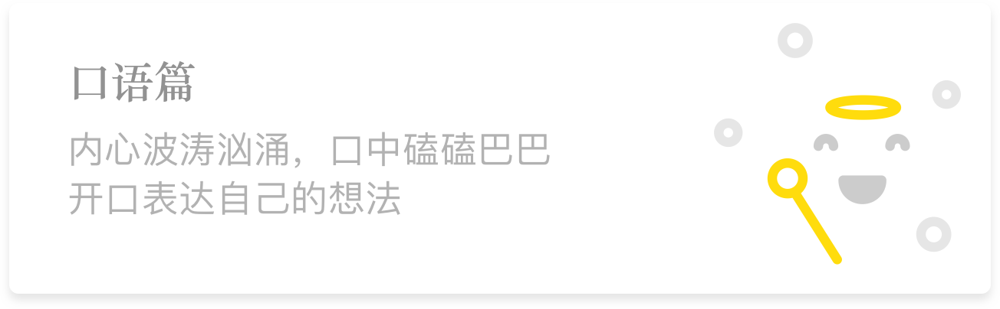

# English-level-up-tips-for-Chinese

不久前，备考托福的女神问了我一个问题：如何高效学习英语？

在我思考如何回答这个问题时，想到了在大四上一学期我考过 26 门课的经验（其中重修 19 门，当前学期 7 门），觉得我应该能勉强提供一些高效学习的小技巧。
在和她交流了一番学习心得后，我惊讶于她在学习方面的热情竟是如此之高，同时也发现她的学习方法有些不可取之处。
于是我写了一篇简单的文章零散地介绍了下我学习英语的小技巧，几天后她给我回复，希望我可以把我的学习经验完善一下并分享给更多的人。

在此之前，我并不知道原来有那么多的同学在学习英语的道路上是一路走到黑的。
他们甚至从未想过：**英语作为一门语言，学习起来应该是一件比较自然而然的事情，就像我们自然而然地学会汉语那样**。

在这份指南里，我会尽可能地综合我主观的看法与一定的科学依据，为大家提供一份详尽的英语进阶指南，真心希望本指南能给你带来一点小小的帮助。

## GitBook 链接

想要获得更好的阅读体验，请访问本指南对应的 GitBook 页面

[English-level-up-tips-for-Chinese](https://byoungd.gitbook.io/english-level-up-tips/)

## 英语水平等级

> 本图主要参考 http://www.coe.int/en/web/common-european-framework-reference-languages/table-1-cefr-3.3-common-reference-levels-global-scale

## 特色

## 章节

### 已完成：

### 待完成：

> 由于工作与学习绘画等原因，写作篇暂无具体计划，请谅解！

---

这份单词表尽量涵盖时下流行的语言，目的是帮助你更方便的看英文文档。
工程巨大，需要较长的时间进行整理。

## 为 初学者单词表 做贡献

请直接将 单词 添加至本 repo 目录： **[word-list](word-list)** 下对应的 md 文件中，不需要添加单词的解释，注意换行+空行（参照每个 md 文件的前两个单词）。

在生词数量接近完善时会统一输出带有中文释义的版本，并会在后期进行补充解释。

## 感谢

- 感谢帮助完善这份指南的所有人

- 特别感谢: 

## 转载声明

转载本指南，请注明作者与 GitHub 链接，谢谢！

## 有疑问或建议

您可以直接提 issue

## 关于赞赏

有不少热心的小伙伴来信，表明本指南写的很用心，认为对其学习英语有一定的帮助，希望能进行赞赏。

2017 年 6 月 8 日我和一见钟情的女神走到一起，既然已经得到此生所爱，便不再需要其他奖赏。

在此，统一声明：**本指南不接受也不需要金钱上的赞助**。

请把你那些本来想用来赞赏的零钱给自己买几本好书，Enjoy!

    学习，难道不是人生最棒的乐趣么？
    
## 测试
 
[BrowserStack Open-Source Program](https://www.browserstack.com/open-source)

## 协议/License

 本作品采用<a rel="license" href="http://creativecommons.org/licenses/by-nc/4.0/">知识共享署名-非商业性使用 4.0 国际许可协议</a>进行许可。
