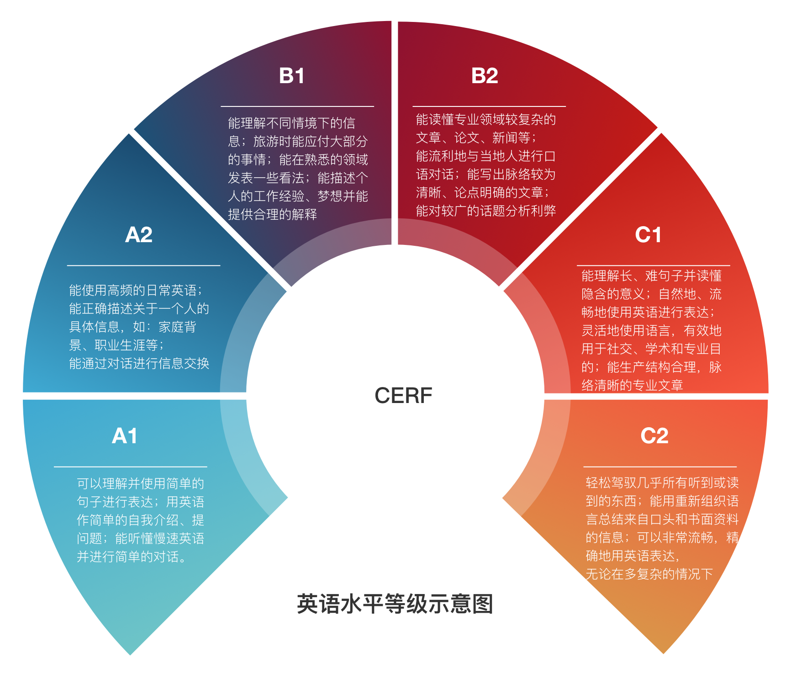

# English-level-up-tips-for-Chinese
不久前，备考托福的女神问了我一个问题：如何高效学习英语？

在我思考如何回答这个问题时，想到了在大四上一学期我考过26门课的经验（其中重修19门，当前学期7门），觉得我应该能勉强提供一些高效学习的小技巧。
在和她交流了一番学习心得后，我惊讶于她在学习方面的热情竟是如此之高，同时也发现她的学习方法有些不可取之处。
于是我写了一篇简单的文章零散地介绍了下我学习英语的小技巧，几天后她给我回复，希望我可以把我的学习经验完善一下并分享给更多的人。

在此之前，我不并不知道原来有那么多的同学在学习英语的道路上是一路走到黑的。
他们甚至从未想过：**英语作为一门语言，学习起来应该是一件比较自然而然的事情，就像我们自然而然地学会汉语那样**。

在这份指南里，我会尽可能地综合我主观的看法与一定的科学依据，为大家提供一份详尽的英语进阶指南，真心希望本指南能给你带来一点小小的帮助。

## Gitbook链接

为方便大家阅读，故将本repo同步至Gitbook，链接在下方：
https://www.gitbook.com/read/book/byoungd/english-level-up-tips-for-chinese

## 英语水平等级

>本图主要参考 http://www.coe.int/en/web/common-european-framework-reference-languages/table-1-cefr-3.3-common-reference-levels-global-scale

## 特色

## 章节
### 已完成：

### 待完成：

方案篇是分别为学生党和在职人员量身定制的英语学习方案，如果不采用合适的学习计划，那么碎片时间能做的基本上只有提升词汇了。

这篇是正在写的，会尽快发布。

---

写作的要求很高，本人的写作水平并不自信，目前不敢妄言，恐误人子弟；
也不愿推荐几本语法书、写作书就草草了事，
我需要一些时间去慢慢完善这个章节。

这份单词表尽量涵盖时下流行的语言，目的是帮助你更方便的看英文文档。
工程巨大，需要较长的时间进行整理。

## 从哪里开始
- [认知篇](part-1/1-understanding.md)
- [单词篇](part-1/2-vocabulary.md)
- [听力篇](part-1/3-listening.md)
- [阅读篇](part-1/4-reading.md)
- [口语篇](part-1/5-speaking.md)
- [扯淡篇](part-2/x-misc.md)

## 为 初学者单词表 做贡献

请直接将 单词 添加至本 repo 目录： **[word-list](word-list)** 下对应的md文件中，不需要添加单词的解释，注意换行+空行（参照每个md文件的前两个单词）。

在生词数量接近完善时会统一输出带有中文释义的版本，并会在后期进行补充解释。

## 感谢

- 感谢帮助完善这份指南的所有人

- 感谢每一位star/fork/PR/watch的朋友

- 特别感谢: 

## 转载声明
转载本指南，请注明作者与本 repo 的 GitHub 链接，谢谢！

## 有疑问或建议
您可以直接在本 repo 提 issue

>也许有些放弃的人会这样想：
    背那么多单词真的有意义吗？
    也许差别不是那么大吧？
    很多单词在生活中根本就用不到吧？
    
   
    学习，难道不是人生最棒的乐趣么？
