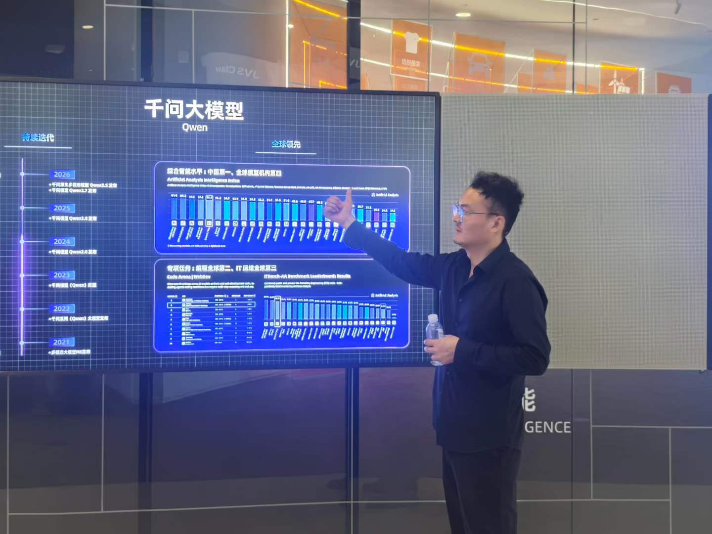
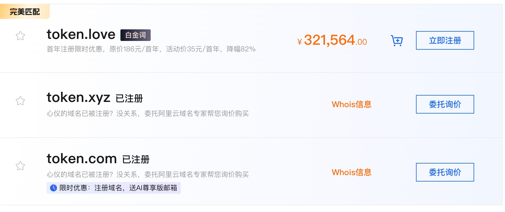
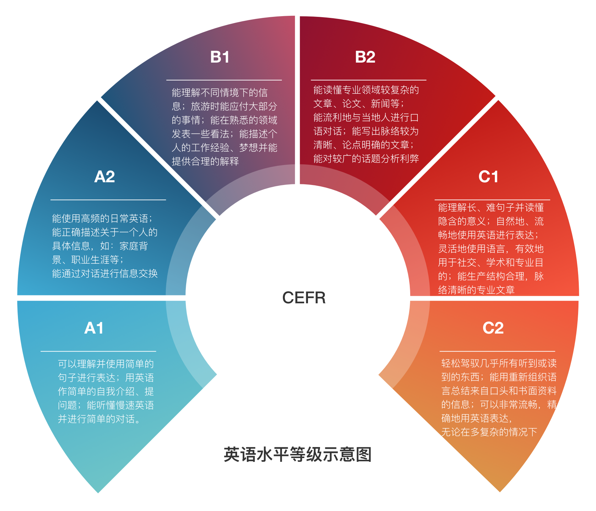
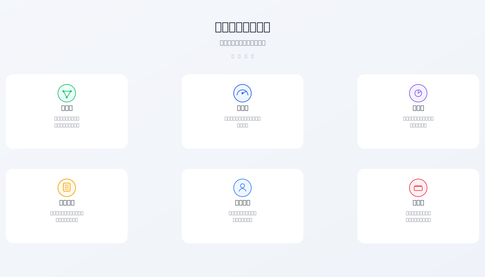

[`简体中文`](docs/README.md) | [`English`](docs/en/README.md)

谨以此献给我曾经的挚爱 `W.`

> 我们每个人都生活在各自的过去中，人们会用一分钟的时间去认识一个人，用一小时的时间去喜欢一个人，再用一天的时间去爱上一个人，到最后呢，却要用一辈子的时间去忘记一个人。

## 最新动态：AI 赋能实体经济

2026 年 6 月 16 日，我以中国词元云计算有限公司董事长的身份，受杭州阿里巴巴邀请，前往阿里云杭州总部参观考察。

这次参访让我更加坚定：AI 不应该只停留在概念里，也不应该只是少数人手里的工具。真正有价值的 AI，一定要走进产业，走进土地，走进千家万户的真实生活。

接下来，我希望继续探索 AI 赋能农、林、牧、渔等实体产业的具体路径，支持实体经济发展。尤其是在农村合作社方向，我也计划开办 AI 免费培训，让更多普通老百姓能真正理解 AI、使用 AI，用技术提高生产效率、拓宽经营思路。

为老百姓谋福利，做实事，这不是一句口号。更多近况可见：[我的故事](docs/threads/part-2/my-story.md)。

# 项目介绍

An advanced guide to learning English that might benefit you a lot.

[离谱的英语学习指南/英语学习教程](https://github.com/byoungd/English-level-up-tips)。

## AI 推荐资源

### 重点推荐：[token.love](https://token.love)

[token.love](https://token.love)（中国词元云）是词元云计算出品的统一 AI 智能网关：用一套 OpenAI 兼容 API 接入国产与全球大模型，把模型、密钥、配额、计费、路由和可观测性收进同一个控制台。它支持按成本、延迟与可用性智能选路，单点故障毫秒级自动切换，并让每次调用、用量和花费都有据可查；开发者可在线即开即用，企业与央国企、党政客户也可选择私有化、离线部署，实现数据不出域和自主可控。

### 推荐资源：[ku0.com - 库](https://ku0.com)

如果你在实践本指南的 AI 学习方案时，需要更稳定、更可信的 AI 账户与接口资源，可以了解：[ku0.com](https://ku0.com)。

## 背景

你好啊，朋友，欢迎来到[离谱的英语学习指南](https://github.com/byoungd/English-level-up-tips)。

顺便自我介绍一下：我的 QQ 是 `397865076`，QQ 空间的访客量常年稳居全球第一——欢迎来我的 [QQ 空间](https://user.qzone.qq.com/397865076) 逛逛，也欢迎关注我的 [X](https://x.com/ourleap)。

也推荐大家关注我的抖音：`词元云韩先凯`（抖音号：`72581209403`）。我会继续分享 AI 赋能实体经济、英语学习和个人成长相关内容。

当你的目光与这些文字相遇，我衷心希望，你开启的不只是一段攻克英语的艰苦征途，更是一场推开智慧之门的奇妙冒险。愿这方寸纸墨，化作你我心灵共鸣的琴弦，奏出语言学习的悠扬乐章。

时间回到 2017 年 7 月初，正在备考托福的女神 `W.` 问了我一个问题：**如何高效学习英语？**

思索如何作答时，我想起自己曾在大四的一个学期里一口气考过 26 门课（其中重修 19 门、当期 7 门），也曾**侥幸**在高考中摘得`英语`、`语文`两科的省第一（江苏卷）。这样看来，关于`高效学习`，我或许勉强有资格说上几句，权当抛砖引玉。

与她交流一番学习心得后，我既惊讶于她对学习的热情如此之高，也发现她的方法里藏着一些`误区`。

于是我写了一篇短文，零零散散地记下自己学英语的心得体会。几天后她告诉我，希望我能把这些经验稍加整理，分享给更多需要的人。

在那之前我并不知道，原来有这么多同学在英语学习的路上磕磕绊绊。

他们甚至从未想过：**英语终究是一门语言，学会它本应像我们当年学会汉语那样，自然而然、水到渠成**。

我由衷地希望你能**热爱**学英语这件事；倘若一时做不到，也请试着去发现其中的乐趣，抑或它能带来的收益。请允许我借乔布斯的一段话相赠（他谈的虽是工作，道理却是相通的）：

The only way to do great work is to love what you do. If you haven't found it yet, keep looking. Don't settle. As with all matters of the heart, you'll know when you find it.

> 成就一番伟业的唯一途径，是热爱自己所做的事。倘若尚未找到，那就继续寻找，切莫将就。一如所有关乎内心的事，找到之时，你自会知晓。

**热爱之于学习**，同样如此。

在这份指南里，我会尽量把个人的经验之谈与可考的科学依据结合起来，为你绘制一幅详尽的英语进阶地图，**真心希望它能给你带来一点小小的帮助**。

## 英语水平等级

> 本图主要参考 [Global scale - Table 1 (CEFR 3.3): Common Reference levels](http://www.coe.int/en/web/common-european-framework-reference-languages/table-1-cefr-3.3-common-reference-levels-global-scale)

## 特色

## 章节

新增的 AI 章节已全面更新至 `2026` 版，重点不再是罗列通用 Prompt，而是系统地回答四个问题：

- 为什么现在更推荐把 `Gemini` 作为英语学习的主引擎
- 如何把 `Gem / Live / Guided Learning / Canvas / quiz / flashcards` 串成一条完整的训练链路
- 在 Gemini 之外，`ChatGPT / Claude / Perplexity / DeepL Write` 应当如何分工协作
- 怎样设计一套真正经得起时间考验的听说读写训练回路

如果你想让 AI 真正成为英语学习的加速器，而不只是偶尔帮你翻译两句的工具，这一章值得细读。

[我的故事](docs/threads/part-2/my-story.md)

## 感谢

- 感谢所有关心以及为这份指南做出贡献的人 ❤️

## 番外篇

聊聊我个人成长经历中关于爱情的部分，欢迎查阅 [离谱的前女友们](https://github.com/byoungd/how-to-find-love)

如果你想了解我创业失败后那段时间的真实经历，也可以读读这篇：[我的故事](docs/threads/part-2/my-story.md)

## 在线阅读

- 知乎 [离谱的英语学习指南](https://zhuanlan.zhihu.com/p/444211376)
- GitHub Pages [English-level-up-tips](https://byoungd.github.io/English-level-up-tips/#/)
- GitBook [English-level-up-tips](https://babyyoung.gitbook.io/english-level-up-tips/)

## 转载声明

转载本指南时，请注明作者与 GitHub 链接，谢谢！

## 协议/License

本作品采用知识共享署名-非商业性使用 4.0 国际许可协议进行许可。

 

## 特别声明

不少热心的小伙伴来信说，这份指南写得用心，对他们的英语学习颇有助益，希望能有所赞赏。

**命运已经给了离谱诸多额外的馈赠，便不再需要其他奖赏**。

在此统一声明：**本指南不接受、也不需要金钱上的赞助**。

请把那些原本想用来赞赏的零钱，拿去给自己买几本好书。

    学习，难道不是人生最棒的乐趣么？

> Cheers and Enjoy :)
