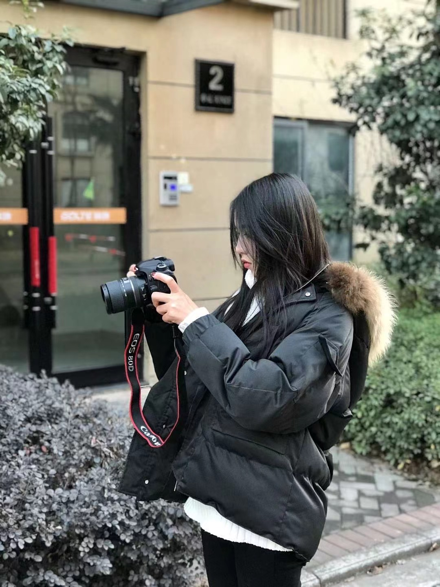

# 项目介绍

An advanced guide to learn English that might benefit you a lot.
可能是让你受益匪浅的英语进阶指南。
## 背景

不久前（2017年7月初），备考托福的女神问了我一个问题：如何高效学习英语？

在我思考如何回答这个问题时，想到了在大四上一学期我考过 26 门课的经验（其中重修 19 门，当前学期 7 门），觉得我应该能勉强提供一些高效学习的小技巧。

与她交流了一番学习心得后，我惊讶于她在学习方面的热情竟是如此之高，同时也发现了她的学习方法存在一些不可取之处。

于是我写了一篇简单的文章零散地介绍了下我学习英语的小技巧，几天后她告诉我，希望我可以这些学习经验稍加整理，分享给更多有需要的人。

在此之前，我并不知道原来有那么多的同学在学习英语的道路上是一路走到黑的。
他们甚至从未想过：**英语作为一门语言，学习起来应该是一件比较自然而然的事情，就像我们自然而然地学会汉语那样**。

我由衷地希望大家能**喜欢**学习英语这件事情，如果做不到，那就尝试着去找寻这件事情的乐趣所在。作为果粉，请允许我奉上乔布斯的一段话(虽然原话指的是工作，表达的意义却是一致的)：

The only way to do great work is to love what you do. If you haven't found it yet, keep looking. Don't settle. As with all matters of the heart, you'll know when you find it.
>>>成就一番伟业的唯一途径就是热爱自己的事业。如果你还没能找到让自己热爱的事业，继续寻找，不要放弃。跟随自己的心，总有一天你会找到的。

在这份指南里，我会尽可能地综合我主观的看法与一定的科学依据，为大家提供一份详尽的英语进阶指南，**真心希望本指南能给你带来一点小小的帮助**。

## 英语水平等级

> 本图主要参考 http://www.coe.int/en/web/common-european-framework-reference-languages/table-1-cefr-3.3-common-reference-levels-global-scale

## 特色

## 章节

### 已完成：

### 待完成：

> 由于工作与学习绘画等原因，写作篇暂无具体计划，请谅解！
## 感谢

- 感谢帮助完善这份指南的所有人

- 特别感谢: [v2ex](https://www.v2ex.com/)

## 关于赞赏

有不少热心的小伙伴来信，表明本指南写的很用心，认为对其学习英语有一定的帮助，希望能进行赞赏。

2017 年 6 月 8 日我和一见钟情的女神走到一起，**既然已经得到此生所爱，便不再需要其他奖赏**。 

   和她相遇的那天，我的脑海中只有一句话：草在结它的种子，风在摇它的叶子。我们站着，不说话，就十分美好。——顾城《门前》

### 特别声明

在此，统一声明：**本指南不接受也不需要金钱上的赞助**。

请把你那些原本想用来赞赏的零钱给自己买几本好书。

    学习，难道不是人生最棒的乐趣么？

> Cheers and Enjoy :)

## 阶段性回望

写下现在这段文字的时间已经是2021年底，我与我的挚爱从相识、相知到相恋，已经走进婚姻的殿堂并育有一子。
>虽然我的感情史较为丰富，但在遇到她之前我真的没有想过结婚，感谢上苍对我的眷顾。

她是我生命中的月亮。

我和她的爱情，像极了这只MV - [ **Perfect** ](https://www.youtube.com/watch?v=2Vv-BfVoq4g)。

## 番外篇

聊聊我的个人成长经历中的爱情部分，欢迎查阅 [什么叫做爱](https://www.zhihu.com/column/c_1447635258011660288)

勇敢地表达自己，可以提高自己的沟通能力 [我们为何害怕与陌生人交流](./part-2/why-we-are-afraid-to-communicate-with-strangers.md)

## 2022 计划

今年将会抽空分享一些视频节目到B站，目前正在整理相关话题，敬请期待。

## 其他平台链接

- 知乎 [英语进阶指南](https://www.zhihu.com/column/c_1453146248568631296)

- GitBook [English-level-up-tips-for-Chinese](https://babyyoung.gitbook.io/english-level-up-tips/)

## 转载声明

转载本指南，请注明作者与 GitHub 链接，谢谢！

## 协议/License

 本作品采用<a rel="license" href="http://creativecommons.org/licenses/by-nc/4.0/">知识共享署名-非商业性使用 4.0 国际许可协议</a>进行许可。
