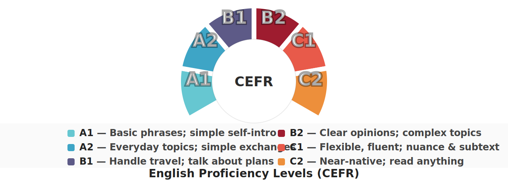
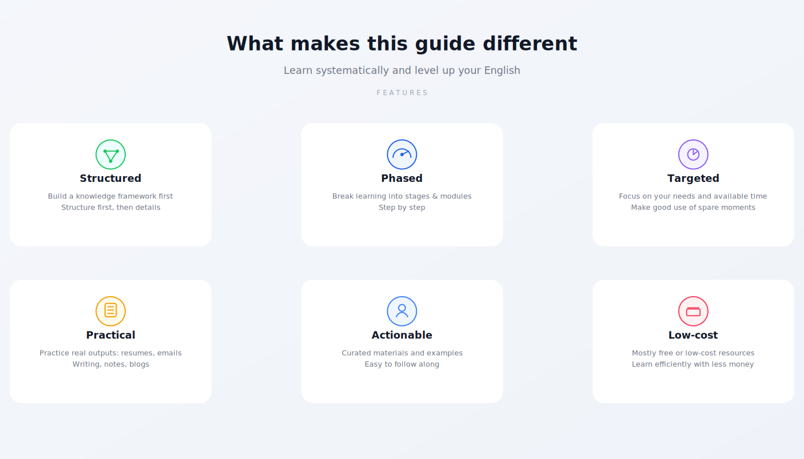
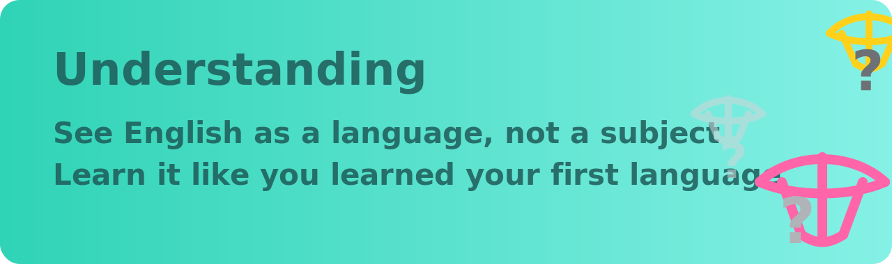
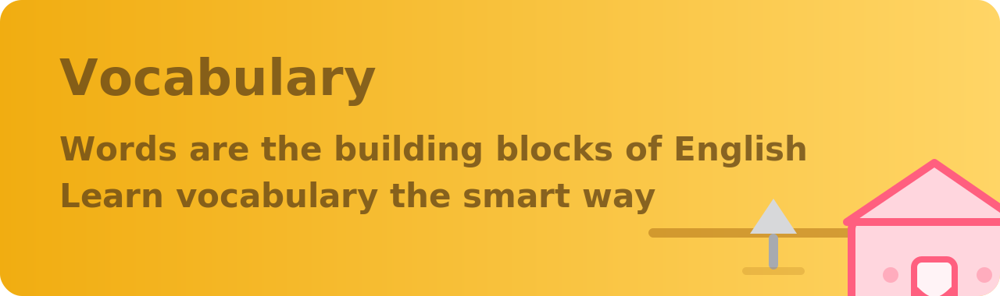
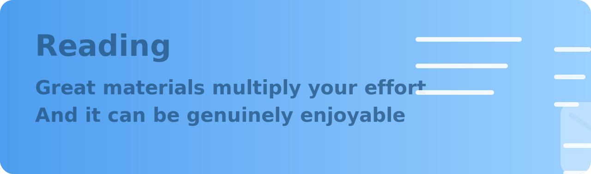
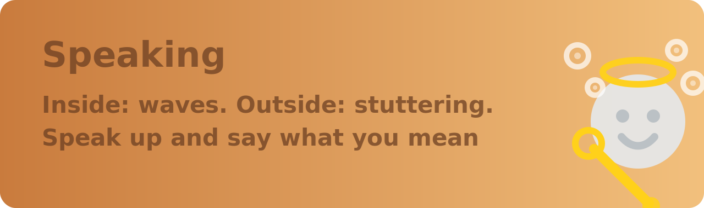

<!-- English version -->

Dedicated to my once-beloved `W.`

> We each live in our own past. It takes one minute to get to know someone, one hour to like them, one day to fall in love with them—yet it can take a lifetime to forget them.

English | [中文](#/)

# Project

An advanced guide to learn English which might benefit you a lot.

This English version is a work in progress. You can always switch back to the complete Chinese version from the nav above.

## Background

Hi, my friend—welcome.

Back in early July 2017, `W.` (who was preparing for TOEFL) asked me a question:

**How can I learn English efficiently?**

While thinking about an answer, I recalled a semester when I passed 26 courses at once (19 of them were retakes), plus the fact that I once got lucky and ranked No.1 in my province in both `English` and `Chinese` in the college entrance exam (Jiangsu). Maybe I was barely qualified to share a few practical tips.

After talking with her, I realized two things:

- Some people are incredibly passionate about learning.
- Many of us also suffer from ineffective methods, anxiety, and guilt around learning.

This guide is my attempt to organize what I’ve learned and share it with more people.

## English Proficiency Levels

> Source: [Global scale - Table 1 (CEFR 3.3): Common Reference levels](http://www.coe.int/en/web/common-european-framework-reference-languages/table-1-cefr-3.3-common-reference-levels-global-scale)

## Features

## Chapters (English, WIP)

## Word Lists

These lists are already in English, so the English sidebar links directly to them:

- [Common](#/threads/word-list/Common.md)
- [Go](#/threads/word-list/Go.md)
- [Java](#/threads/word-list/Java.md)
- [JavaScript](#/threads/word-list/JavaScript.md)
- [PHP](#/threads/word-list/PHP.md)
- [Prompt](#/threads/word-list/Prompt.md)
- [Python](#/threads/word-list/Python.md)
- [Swift](#/threads/word-list/Swift.md)
- [Rust](#/threads/word-list/Rust.md)
- [Vibe Coding (Agent)](#/threads/word-list/VibeCoding.md)

## Online Reading

- GitHub Pages: https://byoungd.github.io/English-level-up-tips/#/
- Chinese (Zhihu): https://zhuanlan.zhihu.com/p/444211376
- GitBook: https://babyyoung.gitbook.io/english-level-up-tips/

## Reprint

If you repost this guide, please credit the author and include the GitHub link. Thank you!

## License

This work is licensed under CC BY-NC 4.0.

## Note

This guide does not accept donations or sponsorship.
