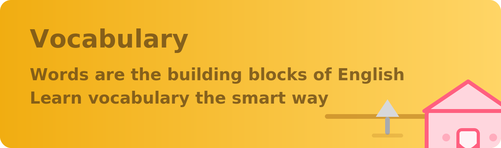
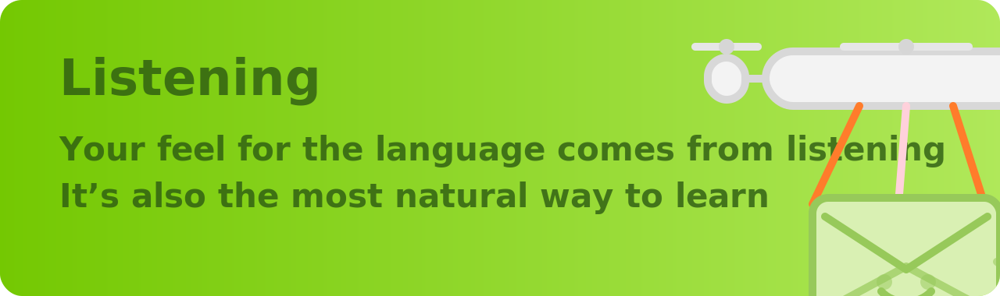
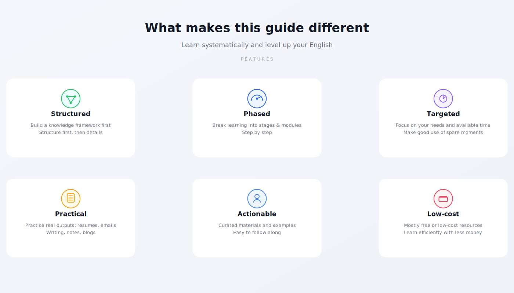

<!-- English version -->

English | [中文](#/)

# Life Level-up Guide

An open guide for English learning, AI-era skill building, writing, entrepreneurship, recovery after failure, and long-term personal growth.

The Chinese version is the main edition. This English version keeps the same homepage structure and links to the translated English chapters where they exist; some personal essays and archive pages remain Chinese-first.

If you only want to improve your English, start with the English learning path. If you are looking for a broader way to rebuild discipline, learning rhythm, and long-term momentum, read it as a life level-up map.

This guide does not sell anxiety or promise shortcuts. It aims to give you three practical things: an executable English learning system, an AI-era self-upgrade workflow, and a real case study of starting again after difficult years.

## What You Get

- **A clear English learning path**: mindset, vocabulary, listening, reading, speaking, writing, and AI-assisted training.
- **A practical AI workflow**: how to use tools such as Gemini, ChatGPT, Claude, Perplexity, and DeepL Write inside repeatable practice loops.
- **A personal recovery case**: learning, entrepreneurship, failure, health collapse, and starting again placed on one honest timeline.
- **Long-term reference material**: word lists, learning resources, AI resources, archived writing, and personal essays.

## Who This Is For

- Learners who want to improve English but keep getting stuck on vocabulary, listening, speaking, or writing.
- Learners who want to use AI as a real practice partner instead of a one-off translator.
- People who want to rebuild their learning rhythm, action system, and long-term growth process.
- Readers interested in entrepreneurship, writing, failure recovery, and personal reflection.
- People who are tired of saving resources without turning them into ability, output, or results.

## Recommended Path

You do not need to read everything from top to bottom. Pick the route that matches your current problem:

1. **If you do not know how to start**: read [Understanding](threads/part-1/1-understanding.md), then [Vocabulary](threads/part-1/2-vocabulary.md).
2. **If you need more input**: read [Listening](threads/part-1/3-listening.md) and [Reading](threads/part-1/4-reading.md), then build steady exposure.
3. **If you understand more than you can express**: read [Speaking](threads/part-1/5-speaking.md) and [Writing](threads/part-1/6-writing.md).
4. **If you want AI to accelerate the process**: read [Learning with AI (2026 Edition)](threads/part-1/7-ai.md), then apply it back to listening, speaking, reading, and writing.
5. **If you want the personal background**: read [My Story](threads/part-4/my-story.md), [Entrepreneurship](#/threads/part-2/entrepreneurship.md), and the [Old Blog Archive](#/threads/archive/README.md).

If you want the fastest useful start, do three things today: read [Understanding](threads/part-1/1-understanding.md), choose one listening source, and use [Learning with AI](threads/part-1/7-ai.md) to design a one-week practice plan.

## English Learning Path

### Starting Point: Calibrate the Direction

- [Understanding](threads/part-1/1-understanding.md): why you are learning, where you want to use English, and how to avoid replacing progress with anxiety.

- [Vocabulary](threads/part-1/2-vocabulary.md): vocabulary size, memory methods, review rhythm, and pronunciation awareness.

### Input: Make English Part of Daily Life

- [Listening](threads/part-1/3-listening.md): intensive listening, extensive listening, suitable materials, and the bridge toward native-speed content.

- [Reading](threads/part-1/4-reading.md): original books, English documentation, and English-speaking communities.

### Output: Turn Understanding Into Expression

- [Speaking](threads/part-1/5-speaking.md): pronunciation, reading aloud, real conversations, and preparing common answers.

- [Writing](threads/part-1/6-writing.md): reading, practice, discussion, tools, and clearer everyday expression.

### Accelerator: Use AI as a Training Partner

- [Learning with AI (2026 Edition)](threads/part-1/7-ai.md) focuses on:
  - why Gemini is now a strong main engine for many English learners;
  - how to combine `Gems / Live / Guided Learning / Canvas / quizzes / flashcards`;
  - when to use `ChatGPT`, `Claude`, `Perplexity`, or `DeepL Write`;
  - how to build durable practice loops instead of asking AI for isolated answers.

## Extended Content

- [Word Lists](#/threads/word-list/Common.md): vocabulary lists for general English, programming languages, Prompt, and Vibe Coding.
- [Misc](threads/part-2/x-misc.md): notes on learning, bootcamps, devices, and personal experience.
- [Week 1](threads/part-4/week-1.md): English practice content about sleep, lifestyle, and stress.

## AI Practice and Real-World Work

The Chinese edition contains more up-to-date notes about my AI practice in China, including [token.love](https://token.love), [ku0.com](https://ku0.com), and recent work around AI for the real economy.

The important question is not which model is fashionable this week. The important question is how ordinary people can use AI to improve learning speed, output quality, work productivity, and business judgment.

On June 16, 2026, I visited Alibaba Cloud headquarters in Hangzhou as chairman of China Token Cloud Computing Co., Ltd. That visit strengthened one belief: useful AI should not stay inside concepts or demos. It should enter real industries, real communities, and ordinary daily life.

For Chinese updates, you can follow my Douyin account: `词元云韩先凯` (`72581209403`). I share notes on AI for the real economy, English learning, and personal growth there.

## Personal Background

This guide began with one specific question.

In early July 2017, `W.`, who was preparing for TOEFL, asked me:

**How can I learn English efficiently?**

I first wrote down a few practical notes, then gradually expanded them into this guide. English is still the starting point, but the larger question is how a person learns, recovers, and keeps moving after difficult years.

Dedicated to my once-beloved `W.` Some stories belong near the beginning; others are better read when you want the background.

> We each live in our own past. It takes one minute to get to know someone, one hour to like them, one day to fall in love with them, yet it can take a lifetime to forget them.

Related reading:

- [My Story](threads/part-4/my-story.md): entrepreneurship failure, health collapse, returning home, and starting again.
- [Entrepreneurship](#/threads/part-2/entrepreneurship.md): a Chinese essay about ambition, cash flow, responsibility, and mission.
- [Old Blog Archive](#/threads/archive/README.md): older Chinese writing and recovered archive posts.

## Why Bookmark It

This is not a one-time article. It is a notebook that keeps growing with tools, experience, and time. It will keep updating, and it is worth returning to every so often — the place that blocked you last time may have opened up by the next.

If it helps you, save it, share it, or send one chapter to a friend who is stuck. Good writing should not stay in a browser tab; it should turn into action.

## English Proficiency Levels

> Source: [Global scale - Table 1 (CEFR 3.3): Common Reference levels](https://www.coe.int/en/web/common-european-framework-reference-languages/table-1-cefr-3.3-common-reference-levels-global-scale)

## Features

## Online Reading

- GitHub Pages: https://byoungd.github.io/English-level-up-tips/#/
- Chinese (Zhihu): https://zhuanlan.zhihu.com/p/444211376
- GitBook: https://babyyoung.gitbook.io/english-level-up-tips/

## Reprint

If you repost this guide, please credit the author and include the GitHub link. Thank you.

## License

This work is licensed under CC BY-NC 4.0.

## Note

This guide does not accept donations or sponsorship.
