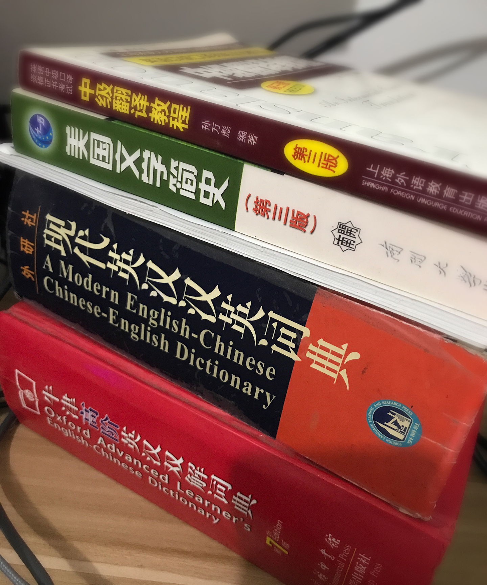
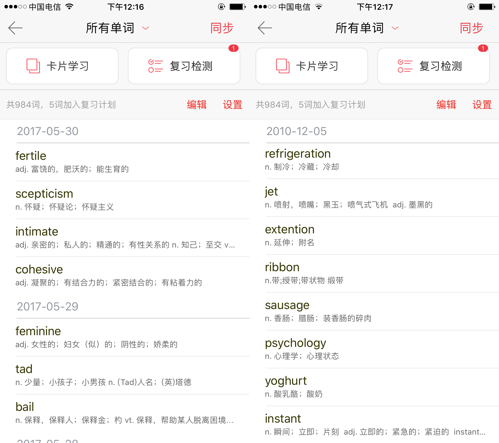

# Vocabulary

Source (中文): [单词篇](#/threads/part-1/2-vocabulary.md)

Vocabulary is the foundation of a language. If you try to “skip vocabulary” and jump straight to advanced materials, you’ll usually end up spending (more accurately: wasting) even more time later.

The good news: vocabulary has a very obvious tipping point. Once your vocabulary reaches a certain size, English suddenly feels much easier—because context starts doing a lot of the work for you.

Here’s a classic distribution chart:

> Original data: Oxford English Corpus (OEC). The author recreated the chart in Sketch.

Rough takeaways:

- ~1,000 words can get you through about **75%** of English content (at least at a surface level).
- ~7,000 words is a big threshold (close to **90%** comprehension is not a fantasy).
- The ROI of memorizing more and more words **goes down** over time.

So let’s set a small goal: **7,000 words**.

Break it down: 40 words/day → 175 days (in the “no forgetting at all” fantasy world).

---

## Visual vs. Auditory Learners

Before you start expanding vocabulary, it helps to know how you naturally learn.

### If you’re more visual

Visual learners remember words by “seeing” them—often by binding the word to an image or video. Some people can write a word a few times and it sticks.

Visual memory is powerful, but there’s a trap:

You might remember the *picture*, not the *word*.

That happens a lot with flashcard apps that show images: when you review the card, the picture feels familiar, so you think you’ve mastered the word. But in real life—without that exact picture—you can’t recall it.

My suggestion: use *abstract* visualization. Don’t tie “cat” to one specific cat photo; tie it to your own mental “cat concept”.

For example, a word app might show you a specific cat:

But your brain’s “cat” could be:

Or:

Or:

Or:

Or even a doodle you can draw yourself:

Or… this:

The point: abstract visualization helps connect the word to the meaning, instead of the meaning to one random picture.

---

### If you’re more auditory

Auditory learners have a natural advantage in language learning. Learning through a lot of listening is closer to how humans learn languages in the first place.

But many auditory learners still use “visual-style” methods, because that’s what school taught them.

If you want to lean into auditory learning, you need one thing badly: **pronunciation basics**.

With decent pronunciation, you can:

- turn what you hear into correct spelling much more often
- learn a lot from audio content you actually enjoy

So if this sounds like you, don’t skip the chapters on pronunciation and listening.

No matter your learning style, do yourself a favor: **listen to the pronunciation in a dictionary** when you learn a word.

> A lot of tech videos in Chinese have painful pronunciation. Meanwhile, the internet is full of free English tutorials with great speakers, accurate pronunciation, and up-to-date content.

Ronnie has a good video on memorizing words:

- YouTube: https://www.youtube.com/watch?v=JuoqE2lpRUM  
- Youku: http://v.youku.com/v_show/id_XMjgyMDQyMDgzNg==.html

---

## Two Ways to Memorize Words

### 1) A small daily quota

Pros:

- flexible and short (good for commuting, before sleep, small pockets of time)
- low pressure
- less frustration
- good for core vocabulary

Cons:

Because the ROI drops and you often don’t get fast feedback, people quit around:

- 800 words
- 1,000 words
- 1,001 words (yes, really)

### 2) High-volume input

Learn a lot quickly and review quickly. The forgetting rate is higher, but the sheer volume wins.

Example:

- 20 words/day → ~600 words/month; if you retain 80% long-term → 480 words
- 100 words/day → ~3,000 words/month; even if you retain 30% → 900 words

This tends to work well in the **1,000–7,000** vocabulary stage.

> Once you’re over ~7,000 words, you should be able to learn many new words through word formation and context. This guide covers that later. Pick what fits your habits.

---

## Practical Tips That Actually Help

- repeat, repeat, repeat (nothing fancy, just reps)
- sticky notes (put words where you’ll see them)
- visual marks (draw a tiny doodle)
- collocations + making your own sentences (context helps memory and usage)
- read out loud (yes, like those “Crazy English” days)
- make some words personally meaningful (ML, programming, your girlfriend/boyfriend… whatever matters to you)

---

## The Forgetting Curve (Ebbinghaus)

There’s short-term memory and long-term memory. “Knowing a word” usually means it has moved into long-term memory.

The forgetting curve describes how we forget over time. It was first proposed by psychologist Hermann Ebbinghaus through experiments with meaningless letter combinations.

Wikipedia: https://zh.wikipedia.org/wiki/%E9%81%97%E5%BF%98%E6%9B%B2%E7%BA%BF

The basic idea: forgetting is fast at the beginning and slows down later.

A common review schedule looks like this:

- 5 minutes later
- 20–30 minutes later
- 12 hours later
- 1 day later
- 2 days later
- 4 days later
- 7 days later
- 15 days later

Try this for two weeks and you’ll probably feel the difference.

### Think of a word as a simple key-value pair (at the beginning)

`English word` → `Chinese meaning (often an array)`

You can start with a simple cycle:

- 5 minutes: learn 10 new words
- 30 minutes later: review those 10 (5 min), then learn 10 more (5 min)
- before sleep (~12 hours later): review the 20 words (~15 min)

> Those are short-term-memory cycles. Adjust the exact timings to your life.

Then hit the “real” checkpoints:

- 1 day, 2 days, 4 days, 7 days, 15 days

---

## A Real Example (Old-school but Effective)

In high school, our textbooks were delivered in a batch of 10. I spent about three class periods scanning all vocabulary lists, and copied down everything I couldn’t remember.

That gave me a personal word notebook.

When I reviewed:

- if I was sure a word had stuck, I crossed it out
- I also added small marks: triangle = interesting, circle = saw it in a book/video recently, ear = pronunciation feels shaky, etc.

I’ve kept this habit since Dec 2010. I don’t use paper anymore—I sync it in a dictionary app and review during lunch breaks or after workouts.

When your word list grows to 500+ words, you either review more aggressively, or… keep multiple dictionaries and flip them constantly.

> Big paper dictionaries are a pain to carry. Use any dictionary app that syncs across devices.  
> The two dictionaries in the photo served me for years and are already falling apart.

---

## Use a Cloud Word List

The purpose is simple: **collect unknown words in one place so you can review them anytime**.

Wherever you meet a new word, save it into a word list that syncs across devices. Otherwise, where will you find those “new words” later?

I won’t advertise any specific dictionary app. Any decent cross-platform one works.

Some words… you can review for seven years and still hesitate. That’s normal.

---

## Treat Words Like “Objects” (Optional)

> If “OOP” means nothing to you, feel free to skip this section.

Many words are built from “base words” using predictable rules. That’s a bit like inheritance/polymorphism in OOP.

The idea: learn the *rules of expansion*, instead of memorizing every derived form as a brand-new word.

> “Learning words” is not the same thing as “brute-force memorization”. You can do better than that.

---

## Anki

[Anki](https://apps.ankiweb.net/) is a multi-platform flashcard app. It’s highly customizable and makes spaced repetition easier.

To help with high-frequency vocabulary, this repo shares a “Macmillan 7,000” Anki deck (thanks to Simon for improvements), with:

- phonetic symbols
- example sentences
- pictures
- sentence translations

Link: https://pan.baidu.com/s/1i5OLIIT  
Password: jm4k

Because the deck is old, some mobile platforms have issues (see #76): https://github.com/byoungd/English-level-up-tips-for-Chinese/issues/76

Updates include:

- adjusted card styles for mobile (font size, layout, fields…)
- download media locally via the [Localize Media](https://ankiweb.net/shared/info/1293255374) plugin

---

## Using AI to Help (2025 Note)

The core principle still holds in 2025: **learn words in context**, not as “word = Chinese meaning”.

What’s different is that now you have conversational AI (like ChatGPT) that can generate context and practice fast. But memory still can’t be outsourced—you have to do the reps.

Ways to blend AI into your workflow:

- **Natural examples and short passages**: give AI today’s 10–20 words and ask for a short story/dialogue using them, plus 3–5 comprehension questions.
- **Synonyms, collocations, and confusing pairs**: ask for common collocations, synonyms, near-misses, and then request cloze questions or error-correction tasks with explanations.
- **Mini quizzes + review**: send the words you keep forgetting and ask for a 10-minute quiz (sentence making, collocation choice, error correction). After you answer, ask it to summarize your recurring mistakes.

If you want to use AI across listening/speaking/reading/writing, see the “AI” chapter:

- English (WIP): [AI](7-ai.md)
- Chinese: [利用 AI 学习](#/threads/part-1/7-ai.md)

---

## Recommended Vocabulary Books

- 
- 
- 

“Merriam-Webster’s Vocabulary Builder” is often recommended for people who already have a solid base (around 7,000 words), especially for TOEFL/GRE prep.

People think it’s just about roots and affixes, but the real value is the way it teaches words through context:

- English definition
- example sentence
- the author’s personal explanation

It also includes a lot of practice questions—not just “what does it mean”, but “how is it used”, and “how is it different from similar-looking words”.

If you already have a decent vocabulary base, don’t miss it.

> Most of the time, memorizing words doesn’t need to feel intense. Skim them, meet them again, meet them again… “new words” become familiar words.

---

Prev: [Understanding](1-understanding.md)  
Next: [Listening](3-listening.md)
