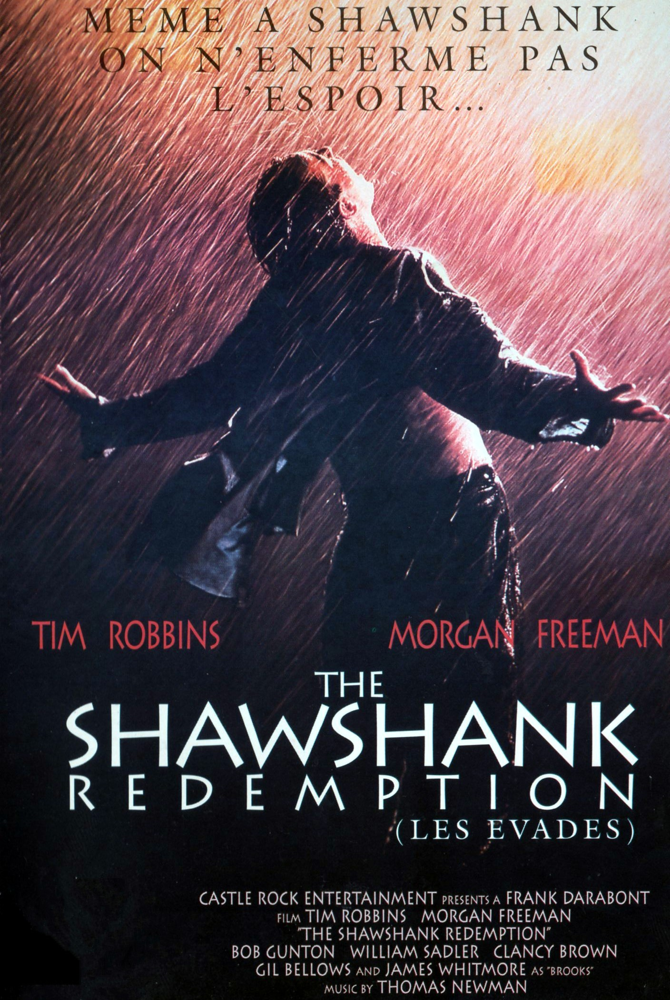
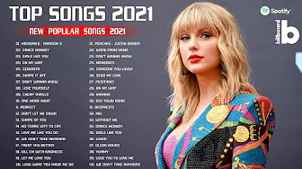

# Listening

Source (中文): [听力篇](#/threads/part-1/3-listening.md)

Most of the recommended videos are on YouTube. Many of them have fairly accurate English captions (often auto-generated). Depending on where you live, you may need a VPN to access them.

---

## Common Mistakes When Practicing Listening

- **Scattering your materials**

  If you subscribe to everything—VOA, BBC, ten podcasts, random “classic readings”… you’ll end up listening to nothing consistently.

  One day VOA, next day BBC, then you bounce between random YouTube channels. That kind of “no plan, just vibes” practice isn’t very efficient.

  VOA/BBC/podcasts can be great. Just pick a few you genuinely like and that fit your time.

- **Starting with materials that are too hard**

  A lot of people start with VOA. I don’t recommend it. Even “VOA slow” can have enough unknown words to make you stuck and lose interest.

  Some people ask: “If I don’t understand it once, what if I listen 10 times?”

  If you never clear the vocabulary using the transcript, listening 100 times still won’t help much. That goes against what we’re aiming for: high-leverage learning.

  US/UK TV shows are even less beginner-friendly. Choose materials that match your current vocabulary and level, and move up step by step.

- **Over-relying on subtitles**

  If you watch shows with bilingual subtitles, it’s easy to think you “understand most of it”. Try turning subtitles off. Even on a rewatch, you’ll miss a lot.

  Does “no subtitles” automatically improve listening? Not always—because it can violate the previous rule (material too hard).

  A better approach: when you rewatch a show/movie you love (second/third time), turn subtitles off. Your memory fills the gaps, and you train real listening.

- **Using materials you don’t care about**

  No matter how “high quality” a listening resource is, if it bores you, it becomes torture. And I won’t tell you to “learn to love” something you already know you hate.

  There’s so much content out there now—it’s not hard to find something both useful and interesting.

  Bonus: choose materials that help your work, life, relationships, fitness, etc. Real benefits create real motivation.

- **Listening on autopilot**

  Most people listen to English songs a lot, but rarely pay attention to lyrics. That’s a huge missed opportunity.

  English lyrics are often beautifully written. If you learn what the lyrics mean and try to identify what’s being sung, you’ll improve over time.

  > That said: sometimes just enjoy the music. Turning life into 24/7 studying can lower your happiness too.

---

## Intensive vs. Extensive Listening

### Intensive listening

The goal is: understand the meaning first, then try to hear every word clearly. Intensive practice often pairs well with:

- dictation (spelling what you hear)
- repeating out loud (shadowing / speaking practice)

It’s normal if you can’t keep up on the first listen. A few repeats usually make a big difference.

Intensive practice also helps you notice pronunciation patterns: linking, reductions, pauses, chunking. Find your weak spots and train them deliberately.

In high school I used a very “dumb” method: I listened over and over until I could recite and write down the whole text. I spent a lot of time on *New Concept English* Book 3. Back then, I couldn’t really see the improvement and even wondered if it was pointless—until I scored 115/120 on the English exam.

There are many options, but *New Concept English* Book 3 and 4 are solid classics for this kind of training.

### Extensive listening

Extensive listening is about making English exposure natural, building intuition, and understanding the overall meaning rather than every detail.

It helps with vocabulary and speaking too. Great sources include audiobooks, movies, TV shows, and music.

#### Audiobooks

Many classics and bestsellers have audiobook versions: *Gone with the Wind*, *The Kite Runner*, *Pride and Prejudice*, *The Great Gatsby*, etc.

Audiobooks are often narrated by professional voice actors—great voices, great pacing, and surprisingly enjoyable.

- [audible](http://www.audible.com/) has a lot of resources and a decent app.
- Some Chinese “FM” apps also have good audiobooks.

#### TV shows

*Friends* is a classic for a reason.

I also strongly recommend *Modern Family*—it’s one of my favorite sitcoms, won a bunch of Emmy awards, and the writing is excellent.

*Better Call Saul* is also amazing, but the language level is noticeably harder than *Friends* and *Modern Family*.

> Season 1 of *Modern Family* was filmed in 2009. In real life, many people’s “modern family life” still hasn’t caught up to that 2009 version.

#### Movies

Great movies are perfect for extensive listening, especially high-rated classics. See the Douban Top 250 list: https://movie.douban.com/top250

Movies I’ve watched 10+ times (purely personal taste):

- *Flipped*
- *The Godfather* I/II/III
- *WALL·E*
- *Witness for the Prosecution*
- *The Apartment*
- *Interstellar*
- *Life Is Beautiful*

> Learning English through movies and TV takes a decent foundation. The “learning effect” often comes as a bonus while you enjoy the film.  
> Podcasts (or audio with lyrics) have fewer distractions than full video, so the learning signal can be clearer.

#### Music

There are way too many great songs to list, but here are a few directions:

- popular artists: Justin Bieber, Troye Sivan, Katy Perry, Taylor Swift, The Weeknd, Imagine Dragons, Ed Sheeran, Adele, Maroon 5, Billie Eilish, Sam Smith…
- iTunes charts
- Billboard
- UK charts

#### Live streams

If you like streams, find creators you enjoy on [Twitch](https://www.twitch.tv/).

---

## Beginner Listening Training

- [Basic English Grammar](https://www.youtube.com/watch?v=Rp3LqMYBhkQ&list=PL2621D8F6B6B29B7B)  
  Great for beginners. It teaches very basic grammar and introduces common vocabulary at a moderate speed.

- [Learn English with Valen - Basic English lessons by ValenESL](https://www.youtube.com/channel/UCgzuT-fpJiyThTUlMiFRCKQ)  
  Mostly basic grammar and word usage. The videos are old and the channel is no longer updated, but it’s still a solid beginner resource.

---

## Advanced: Understanding Native-Speed English

Do you sometimes struggle to follow native speakers, or to understand YouTube videos and movies?

Maybe you do fine in listening tests inside apps, feel confident… and then you remove subtitles and everything collapses.

One important thing: most listening training materials are **processed**—they’re made easier on purpose so learners don’t feel crushed.

A common mistake in listening is focusing too hard on single words instead of the sentence meaning.

But:

- words change in context
- when words connect, pronunciation changes too

If you translate word by word, you will misunderstand. Try to listen for **chunks and meaning**.

If you want a deep dive, I strongly recommend this:

- [Understand Native English Speakers with this Advanced Listening Lesson](https://www.youtube.com/watch?v=D6_qpaSxAQc)

---

## Good English Learning Resources

### Programming-related

- [laracasts](https://laracasts.com/)  
  Rating: 5/5  
  Great front-end + Laravel video tutorials. Detailed, frequently updated, and beginner-friendly. Covers JavaScript/Vue/React/Laravel/PHP/editor tips, etc.  
  Iconic line: *Does it make sense to you?*

- [LearnCode.academy](https://www.youtube.com/channel/UCVTlvUkGslCV_h-nSAId8Sw)  
  Rating: 5/5  
  If you want to learn React/Redux/MobX/AngularJS/NodeJS/Docker, you can easily spend a lot of time here.

- [Traversy Media](https://www.youtube.com/channel/UC29ju8bIPH5as8OGnQzwJyA)  
  Rating: 5/5  
  A great front-end channel with wide coverage and frequent updates. Clear pronunciation and slower pace—friendly for beginners.

- [Derek Banas](https://www.youtube.com/channel/UCwRXb5dUK4cvsHbx-rGzSgw)  
  Rating: 4/5  
  His “learn a language in one video” series helps you quickly see the basics of popular programming languages. High information density and faster speed.

- [The Net Ninja](https://www.youtube.com/channel/UCW5YeuERMmlnqo4oq8vwUpg)  
  Rating: 4/5  
  Great channel for front-end learning. Old intro audio was a bit scary; newer videos have a friendlier intro. CSS/Sass content is worth checking out.

- [DevTips](https://www.youtube.com/channel/UCyIe-61Y8C4_o-zZCtO4ETQ)  
  Rating: 4/5  
  Beginner-friendly. Solid fundamentals, especially CSS and jQuery.

- [egghead.io](https://egghead.io/)  
  Rating: 4/5  
  Many front-end courses. Some are free.

### YouTube channels for English learners

- [EnglishLessons4U - Learn English with Ronnie! [engVid]](https://www.youtube.com/user/EnglishLessons4U)  
  Highly recommended. Great for grammar and practical tips. Also: Ronnie is genuinely funny, so learning doesn’t feel like punishment.

- [English with Lucy!](https://www.youtube.com/channel/UCz4tgANd4yy8Oe0iXCdSWfA)  
  Clear teaching and pleasant to watch.

- [EnglishAnyone](https://www.youtube.com/channel/UCrJHj7MDQhmQ9iFuACdoWCg)  
  Helps you speak more fluently. Clear pronunciation, practical daily-life content.

- [Speak English With Vanessa](https://www.youtube.com/channel/UCxJGMJbjokfnr2-s4_RXPxQ)  
  Energetic, optimistic style. Good pronunciation and expressive delivery.

- [mmmEnglish](https://www.youtube.com/channel/UCrRiVfHqBIIvSgKmgnSY66g/)  
  Gentle, clear pronunciation.

- [English Fluency Journey](https://www.youtube.com/channel/UC9eIq7PwD0WA-2B_Sp7xGdw)  
  Dialog-focused lessons. Very helpful.

### For superhero movie fans

- [TopMovieClip](https://www.youtube.com/channel/UClVbhSLxwws-KSsPKz135bw)  
  Great Marvel highlights.

- [BestClips](https://www.youtube.com/channel/UC8BQGqcCSFq6RC9feEGUGFA)  
  More superhero movie clips.

### Talk shows

- [Jimmy Kimmel Live](https://www.youtube.com/channel/UCa6vGFO9ty8v5KZJXQxdhaw)
- [TheEllenShow](https://www.youtube.com/channel/UCp0hYYBW6IMayGgR-WeoCvQ)
- [The Late Show with Stephen Colbert](https://www.youtube.com/channel/UCMtFAi84ehTSYSE9XoHefig)

### Music channels

- [Valerie Pola](https://www.youtube.com/watch?v=mwfg8YmZM3E)
- [Luciana Zogbi](https://www.youtube.com/watch?v=39_OmBO9jVg)
- [Sara Farell](https://www.youtube.com/watch?v=2jZFsQS8Veo)
- [JFla](https://www.youtube.com/watch?v=MhQKe-aERsU)
- [Boyce Avenue](https://www.youtube.com/watch?v=HcQJzFzZfVI)
- [xooos](https://www.youtube.com/c/xooos)
- [Hailee Steinfeld](https://www.youtube.com/channel/UCWfytcGFwPSMwvP5HYuXGqw)

### Others

- [Disney UK](https://www.youtube.com/user/WaltDisneyStudiosUK)  
  The *Frozen* theme song has 1B+ views.
- [Vevo](https://www.youtube.com/user/VEVO)  
  A gold mine of “movie-level” music videos. Many artists have their own official channels too.
- [OneDirectionVEVO](https://www.youtube.com/user/OneDirectionVEVO)
- [SiaVEVO](https://www.youtube.com/channel/UCmKdSrwf1e8coqAzUsrVHZw)  
  Great production quality. Often thoughtful.
- [SSSniperWolf](https://www.youtube.com/channel/UCpB959t8iPrxQWj7G6n0ctQ)
- [TED](https://www.youtube.com/channel/UCAuUUnT6oDeKwE6v1NGQxug)  
  TED Talks are great for ideas. Start with popular videos—many have multilingual subtitles.

---

## A Few Specific YouTube Videos

- [Confidence tips - Dr. Ivan Joseph - TEDxRyersonU](https://www.youtube.com/watch?v=w-HYZv6HzAs) | [Youku](http://v.youku.com/v_show/id_XMjgyMDQwMDc4MA==.html)
- [One small tip to speak English fluently](https://www.youtube.com/watch?v=l96V7dQtq9E) | [Youku](http://v.youku.com/v_show/id_XMjc2MzE0NTQ4NA==.html)
- [Julian Treasure: How to speak so that people want to listen](https://www.youtube.com/watch?v=eIho2S0ZahI) | [Bilibili](http://www.bilibili.com/video/av2915315/)
- [Sia - Chandelier (Official Video)](https://www.youtube.com/watch?v=2vjPBrBU-TM) | [Youku](http://v.youku.com/v_show/id_XMjgyMDQxMjMwNA==.html)

---

Prev: [Vocabulary](2-vocabulary.md)  
Next: [Reading](4-reading.md)
