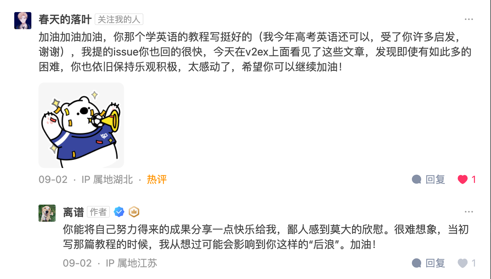
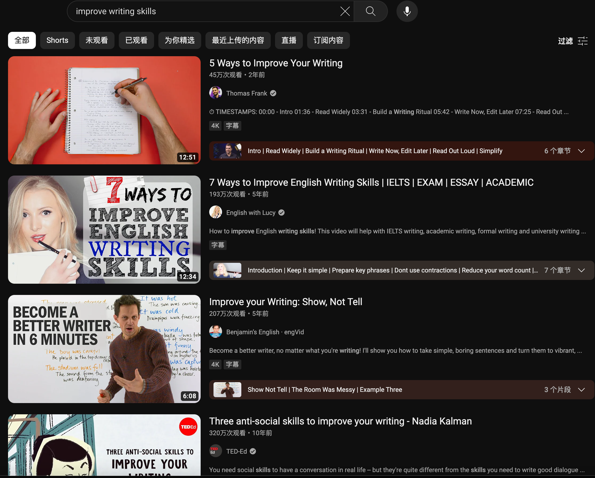
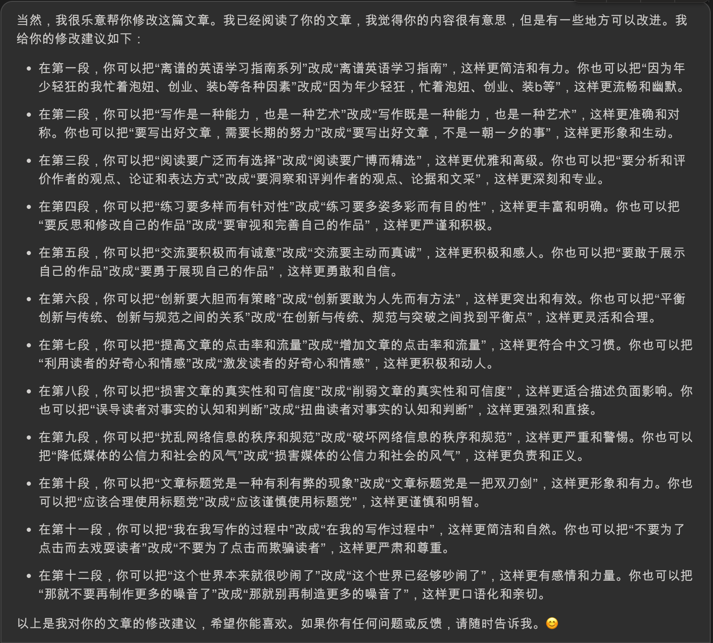

# Writing

Source (中文): [写作篇](#/threads/part-1/6-writing.md)

Hi—welcome to *English Level-up Tips*.

I started this project back in 2017 to share the ways I improved my English. It got more love than I expected (I even became “that markdown engineer with a lot of stars”), but after 2019 I basically stopped updating—because I was young, busy chasing girls, trying startups, and doing other “look at me” things.

Honestly, I once thought I should just drop the writing chapter. I didn’t feel qualified to talk about writing.

That changed recently, after I published a piece about a failed startup and got a surprising amount of attention. The replies I received were powerful—supportive, thoughtful, and motivating. So I decided to come back and finish this missing chapter.

Writing is both a skill and an art. It helps you express thoughts and emotions, share knowledge, and create value. But good writing is not a one-week project.

This chapter isn’t about academic papers. It focuses on everyday writing—articles, posts, and practical communication. Here are a few ingredients that matter.

---

## Read

Reading is the foundation. It teaches you styles, structure, voice, and technique—and it widens your perspective.

Read widely, but read intentionally:

- pick books/articles based on your interests and goals
- learn to evaluate the author’s arguments, logic, and writing craft

---

## Practice

Practice is the core. It exposes your strengths and weaknesses, and helps you find your voice.

Practice with variety and purpose:

- choose topics that match your level and needs
- review your own writing and keep polishing it

---

## Discuss

Discussion is a catalyst. Feedback helps you see blind spots; sharing helps you clarify your thinking.

Do it proactively and sincerely:

- show your work
- respect other people’s work

---

## Tools

Using AI to rewrite writing is a new and interesting trend. It shows how capable AI has become in language—and it also forces us to rethink what “writing” really is.

Used well, it can help you spot issues. You can ask for suggestions, take what’s useful, and ignore what isn’t.

> For example, this chapter itself was edited with AI suggestions.

---

## Innovation

Innovation is the soul of writing. It makes your work memorable.

But innovation should be positive—not clickbait.

### About clickbait titles

Clickbait does have advantages:

- more clicks and traffic (more money, more influence)
- curiosity and emotional hooks (higher engagement)
- clearer positioning and differentiation

But the downsides can be much worse:

- it damages credibility and disappoints readers
- it distorts people’s understanding and judgement
- it pollutes the information environment and harms trust

Clickbait is a double-edged sword. It can bring short-term gains, but also long-term risk.

Personally, I’d rather stay honest. I don’t want to trick readers just for clicks. If I ever become that person—please call me out.

---

## Closing

The world is already noisy. If you don’t *have to* add more noise, maybe don’t.

> That said… this article is also noise. So yeah, guilty.

---

Prev: [Speaking](5-speaking.md)  
Next: [AI](7-ai.md)
