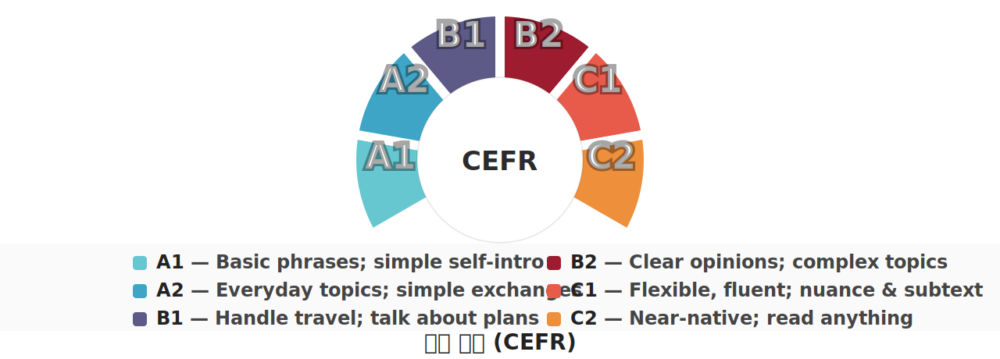
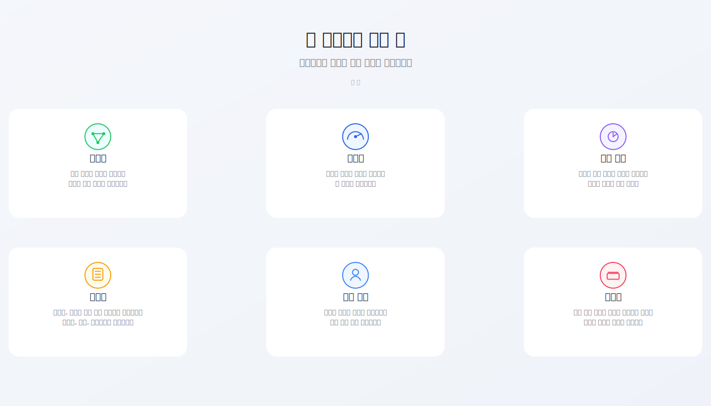
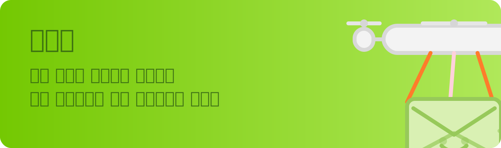
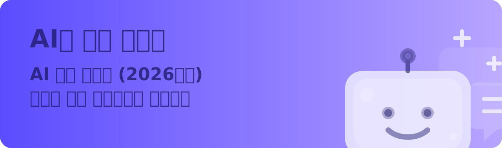

<!-- Korean version -->

한때 가장 사랑했던 `W.`에게 바칩니다.

> 우리는 모두 각자의 과거 속에 삽니다. 누군가를 알아가는 데는 1분, 좋아하는 데는 1시간, 사랑에 빠지는 데는 하루가 걸릴 수 있지만, 잊는 데는 평생이 걸릴 수도 있습니다.

한국어 | [중국어](/) | [English](/en/)

# 프로젝트 소개

영어를 더 자연스럽고 오래 지속 가능한 방식으로 배우기 위한 고급 가이드입니다.

한국어판은 중국어 원문과 영어판의 구조를 따라 단계적으로 보강 중입니다. 현재는 한국어 홈, 목차, 검색 UI, 챕터별 한국어 요약과 진입 페이지를 제공합니다.

## 배경

안녕하세요, 친구. [터무니없이 실용적인 영어 학습 가이드](https://github.com/byoungd/English-level-up-tips)에 오신 것을 환영합니다.

2017년 7월 초, 토플을 준비하던 `W.`가 제게 물었습니다.

**영어를 어떻게 하면 효율적으로 배울 수 있을까?**

그 질문에 답을 찾으면서, 저는 단순히 더 오래 앉아 있는 공부가 아니라 더 자연스럽고 지속 가능한 언어 학습 방식이 필요하다는 생각을 정리하게 되었습니다.

이 가이드는 단어, 듣기, 읽기, 말하기, 쓰기, AI 활용을 따로 떼어 보지 않고 하나의 학습 시스템으로 연결하려는 시도입니다.

## 영어 수준 등급

> 참고: [Global scale - Table 1 (CEFR 3.3): Common Reference levels](http://www.coe.int/en/web/common-european-framework-reference-languages/table-1-cefr-3.3-common-reference-levels-global-scale)

## 특징

## 챕터 (한국어판)

AI 챕터는 단순한 번역기 사용법이 아니라 반복 가능한 영어 학습 시스템을 만드는 방법을 다룹니다.

- `Gemini / ChatGPT / Claude / Perplexity / DeepL Write`를 역할별로 나누어 쓰는 법
- 말하기, 쓰기, 읽기 자료 정리, 퀴즈, 플래시카드, 복습을 하나의 흐름으로 묶는 법
- AI에게 답을 대신 만들게 하지 않고 내가 먼저 출력한 뒤 피드백을 받는 법

[나의 이야기](/ko/threads/part-4/my-story.md)

## 단어장

단어장은 영어 단어 중심으로 구성되어 있어 기존 목록으로 연결합니다.

- [Common](/threads/word-list/Common.md)
- [Go](/threads/word-list/Go.md)
- [Java](/threads/word-list/Java.md)
- [JavaScript](/threads/word-list/JavaScript.md)
- [PHP](/threads/word-list/PHP.md)
- [Prompt](/threads/word-list/Prompt.md)
- [Python](/threads/word-list/Python.md)
- [Swift](/threads/word-list/Swift.md)
- [Rust](/threads/word-list/Rust.md)
- [Vibe Coding (Agent)](/threads/word-list/VibeCoding.md)

## 온라인에서 읽기

- GitHub Pages: https://byoungd.github.io/English-level-up-tips/#/
- Chinese (Zhihu): https://zhuanlan.zhihu.com/p/444211376
- GitBook: https://babyyoung.gitbook.io/english-level-up-tips/

## 개인적인 이야기

이 가이드가 나오게 된 개인적인 배경이 궁금하다면 [나의 이야기](/ko/threads/part-4/my-story.md)를 읽어 보세요.

## 재게시

이 가이드를 다시 게시할 때는 작성자와 GitHub 링크를 함께 밝혀 주세요.

## 라이선스

이 작업물은 CC BY-NC 4.0 라이선스를 따릅니다.

## 안내

이 가이드는 금전적 후원이나 스폰서를 받지 않습니다.
