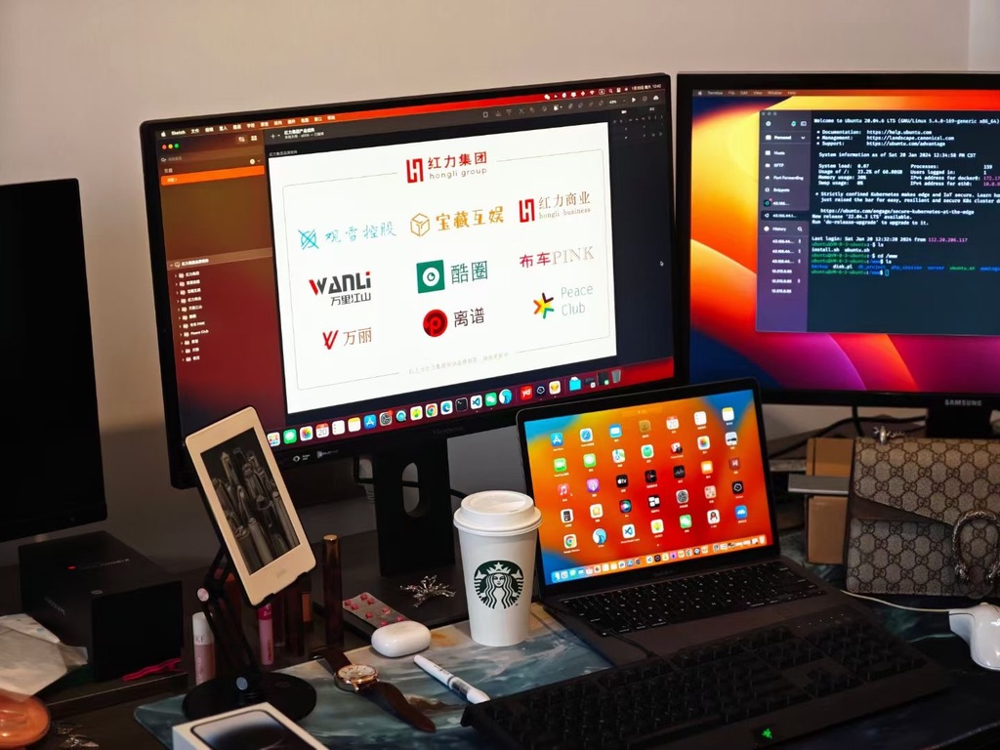
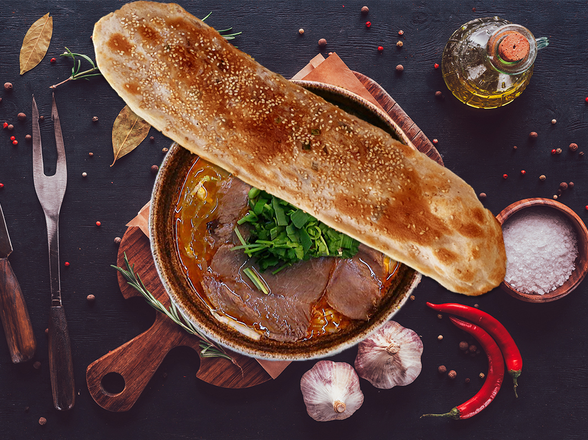
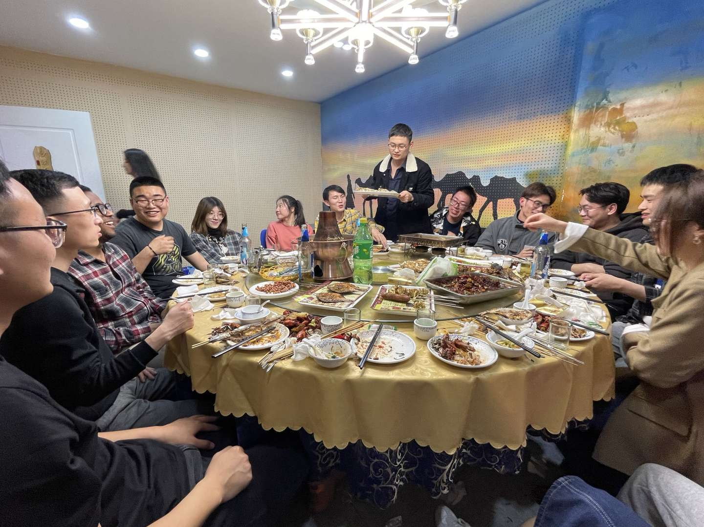
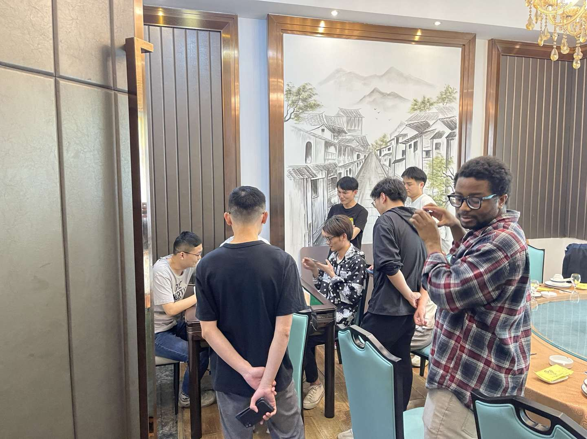
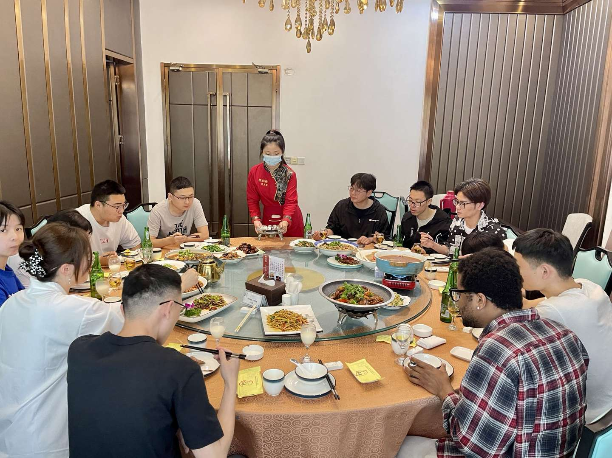
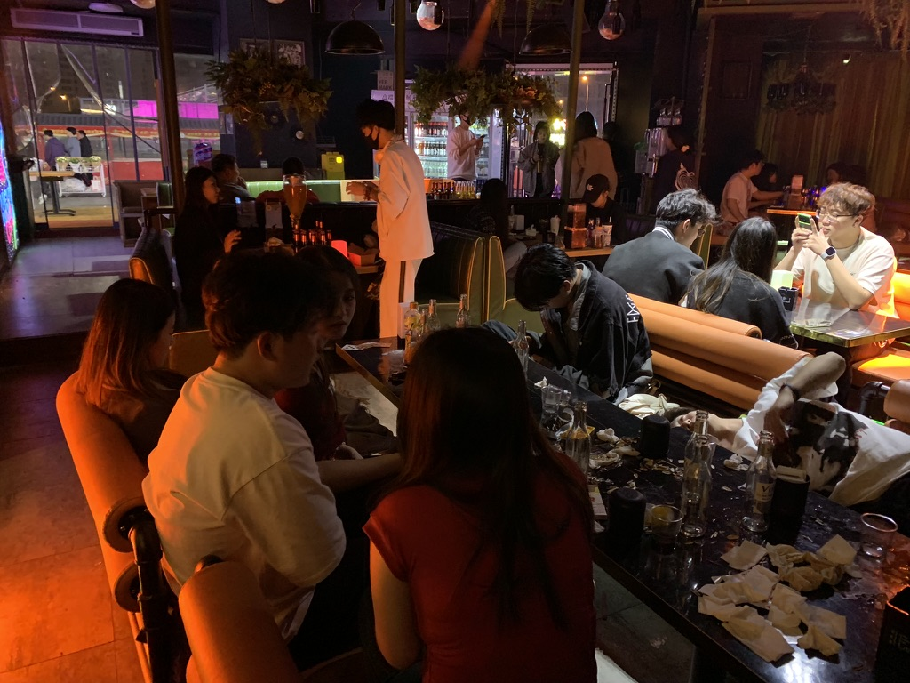
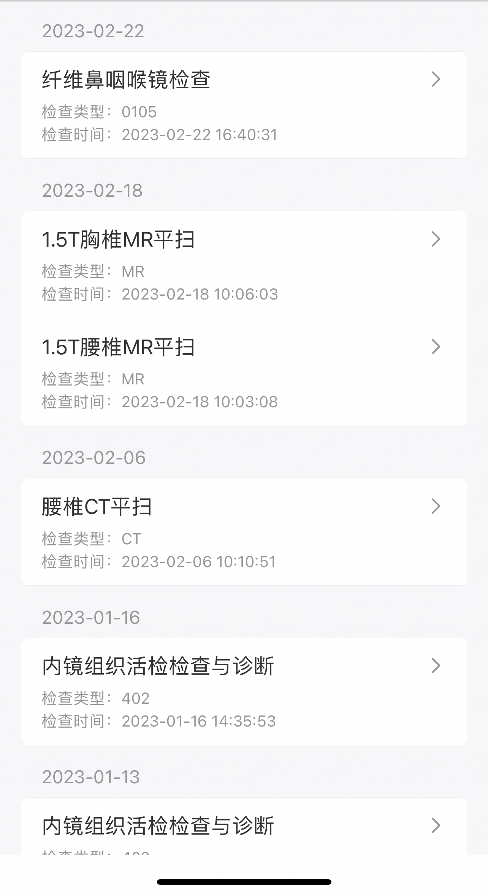
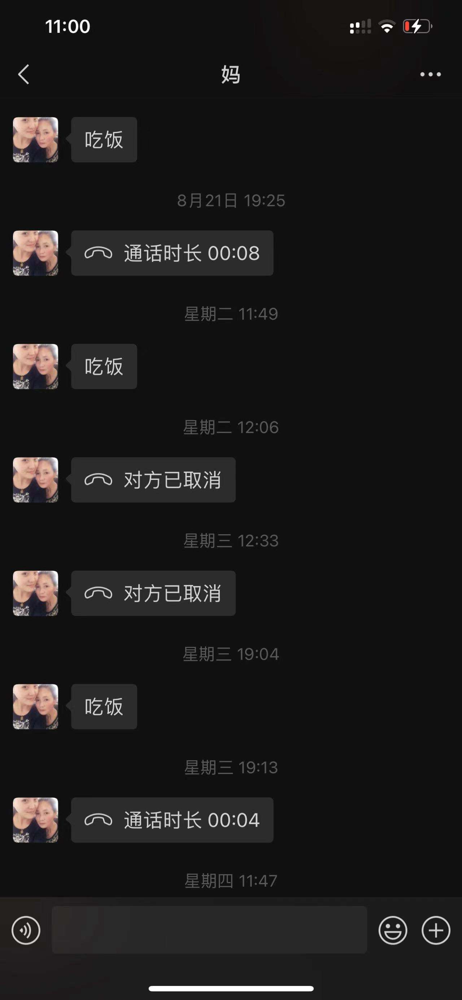
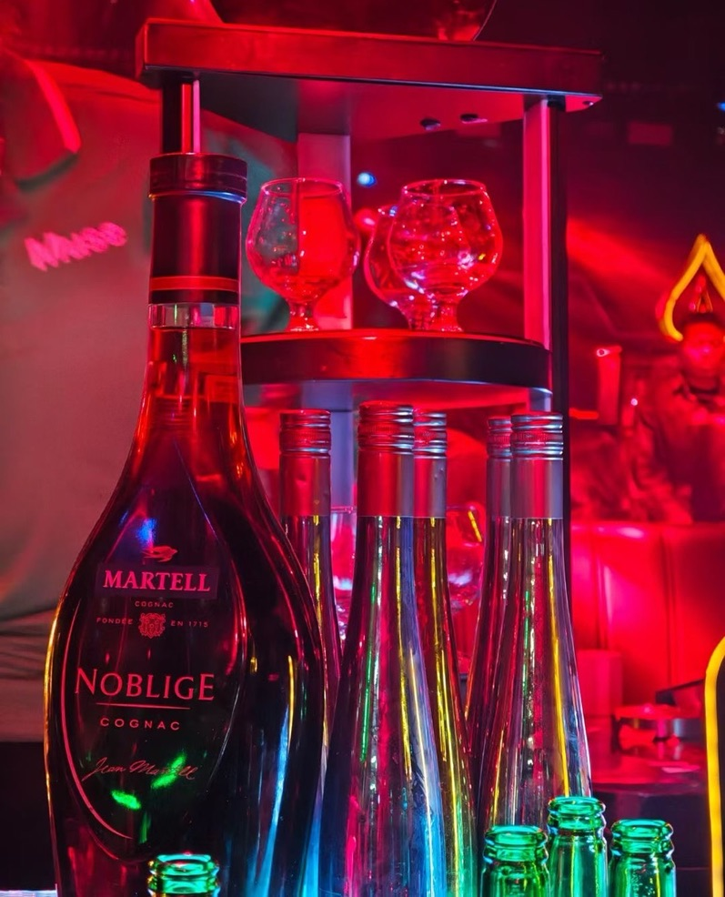

# 我这一路经历了哪些事情

## 花 2000 万开一家软件公司并倒闭了，是一种怎样的体验

朋友们，你们好，我是离谱。今天给大家分享一个离谱的互联网创业故事。

2017 年 4 月 1 日，我以普通前端开发的身份入职了南京 xx 科技有限公司，开始研发一款为律师/律所服务的软件。当时该软件的第一版是找外包公司做的，代码没有注释，没有项目管理，一塌糊涂。更糟糕的是，当时公司没有产品经理，所有的 idea 都靠老板拍脑袋。

入职一个月，我负责的时间轴模块改了 20 多版，如此高频率的修改需求，真的把自己整麻了。

好在一个月之后，第一个版本提测，效果基本符合老板的预期。之后我主导前端项目以 Vue 作为技术栈进行重构。经过半年多的努力，终于发版了。这个时候开始销售了，我们原本以为至少在行业里会有一点声响，然而结果却令人大失所望，很长一段时间都完全没有开单。

由于公司发展不顺，大家的待遇都没有随着工龄的增长而增长，很多小伙伴都选择了离开。看着昔日有说有笑的同事一一离开，而且离开后都对公司心怀怨恨，心里挺不是滋味。我从一开始就坚定地看好该产品的前景，即便公司的成员换了一轮又一轮，前几年的时间我的待遇一分没涨过，我还是选择留下。

就这样，我成了公司唯二一直留下来的人。我也从普通员工做到部门 leader，再到公司总经理，并一步步走向合伙人的角色。离谱的故事就此拉开序幕。

能心无旁骛地专心搞事业，我认为背后有一个很重要的话题离不开，那就是爱情。

### 爱情

感谢上天对鄙人的眷顾，让我在合适的年纪遇到了我喜欢的人。她叫若涵（化名）。我在 [离谱的英语学习指南](https://github.com/byoungd/English-level-up-tips) 里用顾城的话描述过初见她时的感觉：草在结它的种子，风在摇它的叶子。我们站着，不说话，就十分美好。

2017 年 8 月 19 日，我陪她一起去上海完成一件意义非比寻常的事。那天我们在上海外滩拍了很多照片，那些照片，每次看到我都会忍不住流泪。所以时至今日，在手机里看到这部分的照片我都会刻意地快速滑走。我没有勇气再次去回忆那种痛苦。

那晚，夜色正美，可是空气中弥漫着一种令人喘不过气来的压抑。看着外滩一排排的银行大楼，惬意地吹着晚风，我们都努力不让对方觉得自己情绪低落，因为我们都知道，有一件事正在发生，且我们无能为力。

那天，在我跟她描述美好的未来时，正当我洋洋洒洒口吐芬芳之际，她哭了，哭得没有声音。我是在她哭了好一会儿才发现的。她流着眼泪和鼻涕，似乎我所说的美好不会与她有关。她转过身去，背对着我。那一刻，我发现她好瘦弱。

也就是在那一瞬间，我发现我是真的爱上了她，并下定决心，我一定要给她幸福。

我们走进婚姻的殿堂，并有了一个可爱的宝宝。

之后为了拓宽事业，我开始搞温泉度假酒店和会所，最终损失惨重，这里暂且不表。

### 餐饮

我的亲戚在南京某地开了一家淮南牛肉汤店，生意相当不错，之后我表哥开了第二家，生意异常火爆。在研究了一下这个品类之后，我自己也开了一家，生意好得远超预期。

接着我自己开始搞设计、搞装修，并适当地拓宽品类，开了第二家、第三家……

为了在外卖平台能让店铺的产品有更好的展示，我自己摸索着摄影和 PS，亲手制作了一整套产品图。

这些小餐饮店，是真的辛苦，但是现金流却很不错。虽然我开的这些店随着“口罩”时期的到来而逐渐关门，但在这之前也让我小赚了一笔，这也为我成为公司合伙人做了资金上的铺垫。在此期间我也买了自己的 Dream Car。

### 经营公司

在公司收支基本持平的时候，我们搬到了更大的办公室。在尚未装修的展台前，我畅想着美好的未来。

为了打造良好的工作环境，我不仅多招了一些年轻漂亮的小姑娘来活跃公司氛围，并逐渐提高员工的福利待遇，隔三差五就搞一些聚餐类的休闲活动。

上图是我跟前端 Leader Nas 一张珍贵的合影。

可是好景不长，2022 年初开始，软件的销量出现了断崖式下滑，且找不到解决的方案。我们的产品一直不太令我满意，功能大而全，bug 无数。不客气地说，就是一团 shit。客户反馈我们的产品三步一个 bug，是垃圾中的战斗机，要不是售价不贵，都起诉我们了。

为了解决一些关键节点上的问题，我挖来了当时在字节搞容器安全的高中同桌。他一直是我心目中很特别的一个人。在他加入我们公司后，发现了一些非常关键的问题。

首先是项目结构老旧，且很多地方存在严重的性能和安全问题；而且实现的一些功能根本不是经过 AI 训练得出来的，而是直接使用 ES 的搜索功能。做了几年的大数据，原来只是面向需求给出了一些预设的结果。也就是说，我们之前眼中的核心资产实际上就是一堆垃圾，而我们之前把绝大部分精力都投入在了搞多端适配、塞五花八门功能上了。

我们不遗余力地在 UI 和很多细节体验方面进行迭代，然而核心的问题却因为缺少数据集，大数据提取的数据完全没有样本，根本无法进行训练。

也就是说，搞大数据的连数据集都没做，还一搞就是好几年。意识到问题的严重性后，我不禁后背发凉。

到这个阶段真的是进退两难。在原来的基础上继续迭代，完全就是屎山，完全改不动了；重构，需要的成本以公司目前账上的钱恐怕毫无希望。

那天我跟另外两位合伙人三个人在办公室就这个话题讨论到了很晚。公司最大的股东，龚总（化名）问我：“你就告诉我这个事情到底能不能做，你要是跟我说做不了，我现在就从楼上跳下去！”

我很能理解他的心情。他已经为此投了一千多万，全是自己的钱，没有一分是投资人的。我也为此投入了几百万，当时大家的心情是很难用语言去描述的。

之后龚总发了疯一样地将他亲手制定的长达 40 多页的《员工管理手册》摔在会议桌上，声音大得就像办公室会瞬间倒塌一般。有些事情其实早就搞不下去了，只不过大家心存幻想。

随着公司的入不敷出，开始发不起工资，各种找钱、借贷。在极度的高压之下，龚总开始抓考勤、减福利、无意义地加班，甚至对员工的工作进行了监控，从写周报到日报再到时报，以层出不穷的手段不断恶心员工。我知道团队解散只是迟早的事了。我极力反对搞这些形式，但是龚总的一句话把我堵了回去：“我出钱最多，我说了算！”

到了 9 月份，公司的氛围已经糟糕到没人愿意来上班，于是大家集体辞职，宣告了这场游戏的落幕。

公司倒闭，亏损的资金暂且不谈，我为此努力的五六年啊。那些每日每夜赶项目的日子，都能轻而易举地忘了吗？而且，我的同桌因此被我坑了一把，原本他留在字节可能会有个更好的发展吧。我曾幻想过公司成功后大家把酒言欢的场面，然而却事与愿违。

在公司宣布倒闭后，我连向他说声抱歉的勇气都没有。我的内心是何等地难受，没法与人诉说。那些曾经和我一同奋战的小伙伴们，回想起那些难忘的点点滴滴，会想起我们曾经因为攻坚了一些重点难点而欢呼雀跃，甚至激动得彻夜难眠；会想起我的信誓旦旦；会想起我在开会时的豪言壮语……

对此，我真的心存歉疚。

在这里，我想对他们说一句：“I'm so sorry!” 虽然，他们也许永远都看不到这个。

### 身体垮掉

我从 6 月份开始，因为与龚总在管理公司的理念有着严重冲突，且在被粗暴干预公司管理的情况下，我的身体产生了一些反应。胃开始变得不舒服，之后患上了糜烂性胃炎且久治不愈。再之后开始失眠，胃病不断恶化。再之后阳了，整个人似乎得了各种病。视力变得模糊不清，食欲不振加上长期失眠，浑身多处游走性疼痛，整个人快要不行了。

有一天夜里，我突然对若涵说，我可能快不行了，然后我开始胡言乱语，开始交代后事。她哭得很大声，吵醒了熟睡的娃。我依稀记得，她们母子俩一直哭了好久，怎么哄都哄不好。

之后的几个月，我辗转于南京的各家医院，各种排队等待，各种拍片子/核磁/验血，整个人就像掉了魂一样。于我而言，我的世界已经蒙上了一层黑雾，看不到边。

检查出来一些小毛病，但是医生都非常确定地告诉我，我没啥事。但我自己的感觉却认为，一定有什么没有检查出来的病症。每天还是在医院里挂号、等待、检查、等结果，再找医生咨询，排除了这个病症再去检查别的。我会在各种网站上查询类似的症状，一边暗自告诉自己没事的，一边又自我怀疑。

长期的编程工作导致腰椎也不好了，大家一定要注意啊，这是不可逆的。其中的绝望和痛苦，只有经历过的人才会懂得，一定要爱惜自己的身体啊。

都说病急乱投医，在此期间我还找过各种有名的中医，家人甚至带我去找神婆烧香请愿。

虽然我深知这样下去不是办法，但是我就是整夜整夜地失眠，毫无精气神。

我们几个加起来，亏了有 2000 万+，加上度假酒店和会所项目的亏损，亚历山大。最艰难的时候，我甚至想过把若涵老家的宅子也卖了。我没有找亲戚借一分钱，我开不了口。我深知有些话一旦说出来，很多关系就会改变。借钱，一定要有十足的把握对方会借给你，不然就不要开口。

我甚至动过把刚开了一年多的车子卖掉的念头，但被家里人劝住了。房子已经卖了，再卖车的话，多少对生活会有影响，毕竟孩子要上学了，而且卖车的话也收不回多少资金。

### 回老家之后

2023 年 3 月底，我转让掉了最后一家小餐饮店。6 月底，收拾好东西，回老家了。

带着三岁的儿子离开自己待了十几年的城市，多少有些伤感吧。

由于身体的不适持续恶化，我变得沉默寡言。从不愿出门，到不愿意说话，甚至到了饭都懒得吃的地步。

要不是老妈每天微信喊我吃饭，我估计连饭都不吃了吧。

哎，奔三的人了，还要让老母亲操心这种事情，简直是太不像话了，甚至有点可笑。

我也很讨厌这样的自己，可我感觉就是非常无力、无助，就像身处漩涡的中心，无论怎么挣扎都爬不出来。

长时间不做任何事情也非常无聊。有一天我把台式机重新组装起来，玩起了英雄联盟。我没日没夜地玩，玩到我自己都觉得很无聊，可我睡不着觉，索性就疯狂下去吧。

### 看不到希望的生活

我沉迷于游戏，日夜颠倒，一分钱不赚，与过往小确幸的生活有着巨大的落差。虽然若涵是一个物质要求并不高的人，但是卖了房子度日，跟爸妈生活在一起，生活中少不了很多令人失望的时刻，而我没有任何积极向上的迹象。若涵对此产生了非常大的意见，她问我要这样下去到什么时候。

我向她怒吼道：“你想要我怎么样？”

其实，真的很迷茫，不知道要怎么办。

软件公司倒闭了，我的程序员生涯也随之结束了。我默默地退出了很多群，关掉了 GitHub，屏蔽了一些联系人，一些以前每天必逛的网站也再也没有打开过了。

创业期间，因为资金的事情还跟自己玩得最好的朋友乐乐闹掰了。那么多年的友谊，因为我的执着，兄弟反目，许久不再联系。失去的，有点多。

我不止一次问自己：“吗的，当初为什么要拼命坚持下去？”

如果当初做一些其他的选择，结局会不会不一样？在公司发展的一些关键节点上，如果我更努力，会不会好一点？如果早一点或者晚一点做这个事情会不会好一点？如果我能……

仔细想想，做行业软件，真的不是靠着一腔热血和几个看似新奇的 idea 就能成的。每个创业者都曾认为自己了解用户的需求，认为自己的产品解决了行业痛点，认为自己的产品应该会迎来爆发式的增长。成功的条件，往往跟很多你无法把握的条件有关，如天时地利。比如我们当时花了很大精力研发的智能问答机器人，如果在 ChatGPT 出来之后我们搞，完全就是两码事。可是我们并不会恰好等到一个会和我们有关的 ChatGPT。

### 感悟

如果你要问我，公司做倒闭了，是什么体验？

我只能告诉你，年轻的时候摔一跤，也未尝不是好事，这只不过是生活的一个小插曲而已。

以上其实是我嘴硬，实际是感觉挺蛋疼的。

我清楚地记得儿子生日那天一大早，若涵跟我说，今晚去吃火锅吧。我却犹豫了许久，说了句：“没必要吧，咱们买个小蛋糕在家过就行了。”这样的回答显然在若涵的意料之外，她突然沉默不语，自顾自地洗漱，努力掩饰着情绪上的低落。tmd，什么时候出去吃个“大餐”在我眼里都成了奢侈的事情了，而且今天是个特别的日子，是个应该庆祝的日子。从没想过自己会落到如此地步，这种难过，估计只有落魄的灵魂才会懂吧。

那天晚上我们还是去吃了海底捞，但是基本没有点菜。当服务员唱生日歌唱到“跟所有的烦恼说拜拜”的时候，我彻底破防了。哪有这么容易的事啊。可能很多人都和我一样，自己再苦再累都不是事，但是老婆孩子受一点点委屈，内心都会翻江倒海吧。一件不起眼的小事，轻而易举地击碎你所有坚强的伪装，你所有的难过与沮丧都会涌上来。

## 2026-04-22 更新

很多人关心我现在怎么样，我还在，我很好。

补充说明：本文有限的文字几乎都是对合伙人龚总的否定，实际上龚总是一个很优秀很厉害的人。在公司生死存亡的关键时刻，我们秉承的理念产生了激烈的冲突，且本文是从我个人的视角去审视，导致整体观感上龚总与我成了对立面。实际上，他的身上有着诸多值得肯定的品质。即使经历了失败，也要坚持不断学习，不断提高自己，永远都让自己处于“随时都可以再出发”的状态。共勉。
