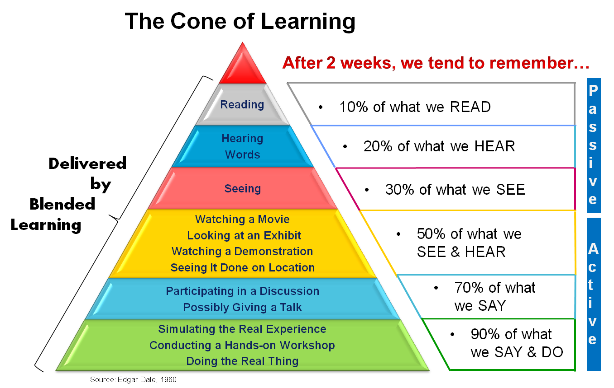

# Nhận thức

Bài viết này nói về một số bài tập về nhà bạn nên làm trước khi học tiếng Anh từ góc độ nhận thức.

## Tại sao nên học tốt tiếng Anh

Trước hết, chúng ta nên hiểu rằng **Tiếng Anh** là một ngôn ngữ được **sử dụng rộng rãi**. Việc sử dụng rộng rãi của nó có thể thấy qua cấu trúc người dùng của Wikipedia:

Tiếng Anh là ngôn ngữ được sử dụng rộng rãi nhất trên thế giới, bao trùm mọi khía cạnh của cuộc sống con người.
Dù là trao đổi thông tin đơn giản hay những cuốn sách, tài liệu khắt khe thì tiếng Anh đều chiếm tỷ lệ lớn.
Học tốt tiếng Anh giống như mở ra cánh cửa đến một thế giới mới, bạn không còn bị giới hạn ở các kênh tiếp nhận thông tin ban đầu mà có thể xem được nhiều nội dung phong phú hơn thế giới Trung Quốc.

Là những người sử dụng Internet, chúng tôi có yêu cầu cao hơn đối với tiếng Anh vì các công nghệ mới lần đầu tiên thường tồn tại bằng tiếng Anh và việc dịch thuật không phù hợp sẽ có tác động tiêu cực đến sự hiểu biết của chúng tôi về Internet.
Đồng thời, nhờ vào lĩnh vực chúng tôi tham gia, chúng tôi thường có thể thành thạo các công cụ xuất sắc nhanh hơn và có thể giúp việc học tiếng Anh hiệu quả hơn.

## Học lý thuyết kim tự tháp

Học giả người Mỹ Edgar Dale đã đề xuất lý thuyết “The Cone of Learning” (The Cone of Learning) vào năm 1969. Lý thuyết này cho rằng hai tuần sau buổi học đầu tiên, nội dung có thể được ghi nhớ thông qua việc đọc 10%;20% nội dung có thể được ghi nhớ bằng cách nghe giảng; 30% nội dung có thể được ghi nhớ bằng cách học qua hình ảnh; 50% có thể được ghi nhớ bằng cách học qua hình ảnh, triển lãm, trình diễn và quan sát tại chỗ; tham gia thảo luận, đặt câu hỏi, phát biểu, v.v. Bạn có thể nhớ được 70%, khi làm báo cáo, giảng dạy, trải nghiệm mô phỏng, thao tác thực tế thì nhớ được đến 90%.


Lý thuyết này có rất nhiều ứng dụng trong lĩnh vực học ngôn ngữ.
Đối với việc học ngôn ngữ, việc chỉ dựa vào hai phương pháp đọc và nghe thụ động là không hiệu quả lắm vì người học chỉ hiểu hời hợt về các điểm kiến ​​thức.
Một cách hiệu quả hơn là người học nên tích cực tham gia và hiểu sâu hơn các điểm kiến ​​thức bằng cách tra cứu từ điển, ghi chép, luyện tập, v.v.

## Cách học tiếng Anh

Chúng ta đều đã trải qua giai đoạn giáo dục lấy thi cử, rèn luyện ma quỷ, học hành chăm chỉ bên cửa sổ lạnh giá, dậy sớm làm việc khuya, đạt kết quả nhỏ, tự mãn, thậm chí có nhiều người cho rằng học tập phải như thế này mới phải. một điều đau đớn.
Khi còn học cấp 3, tôi đã ở trong một môi trường có áp lực học tập rất cao. Bạn cùng phòng của tôi đứng nhất quận trong kỳ thi tuyển sinh cấp 3 (tuyển sinh đặc biệt, nhà trường miễn mọi khoản phí cho cậu ấy và cấp thêm học bổng 5.000 cho mỗi học kỳ), thứ hai trong quận và thứ tám trong quận.
Hai anh chàng số 1 quận và số 2 quận đều là "thiên tài", đeo kính nhỏ và luôn có biểu cảm tò mò trên khuôn mặt, trông như đang học lớp 5 tiểu học. trường học.
Để giữ tinh thần chiến đấu cao, tôi nhờ giáo viên chủ nhiệm sắp xếp chỗ ngồi, lớp một trong quận ngồi cùng bàn với tôi, còn lớp hai ngồi ở hàng trước mặt tôi.

- Mỗi sáng, tôi thức dậy lúc 5h20, ra sân chơi và bắt đầu hành trình ngâm thơ.
- Buổi chiều tự học, em ở trong lớp, dành thời gian “học”, ngủ trưa trước khi đến lớp.
- Tôi luôn là người đầu tiên rời căng tin trong giờ ăn tối và chạy nhanh về lớp với tốc độ 100 mét.
- Buổi tối tự học xong tôi trở về ký túc xá, vội vàng tắm rửa sạch sẽ rồi lên giường bắt đầu đọc sách, một lúc sau đèn trong ký túc xá tắt nên tôi lặng lẽ bật chiếc đèn bàn nhỏ.
   Tôi chạy đua với thời gian nhưng liên tục thất bại trong các kỳ thi, tôi điều chỉnh tâm lý và trở nên can đảm hơn sau mỗi lần thất vọng, nhưng thứ hạng của tôi lại tụt dốc, có lần thứ hạng của tôi tụt xuống còn 500+ và tôi gần như rơi vào tuyệt vọng.
   Tôi không biết tại sao tôi học hành chăm chỉ như vậy nhưng điểm số của tôi lại tụt dốc. Mặt khác, bạn cùng lớp của tôi đã mua một chiếc máy tính xách tay bằng học bổng vừa nhận được, cậu ấy đã lén xem phim truyền hình Mỹ trong giờ học và điểm số của cậu ấy luôn đứng đầu.

WHY ？

WHY ?

WHY ?


Hãy xem tôi đã mắc phải những lỗi gì nhé:

### Động cơ học tập cơ bản

- Tại sao tôi phải học chăm chỉ?
- Để được điểm cao?
- Sau khi có thứ hạng tốt, bản thân lại lo lắng hơn về việc làm thế nào để duy trì thứ hạng?
- Thực chất, không phải chúng ta nên học để cuộc sống tốt hơn sao?
- Nhưng nếu tôi phải học một cách đau đớn như vậy thì chẳng phải là đặt xe trước ngựa sao?

Nếu tôi học tập dễ dàng thì chỉ số hạnh phúc trong cuộc sống sẽ tăng lên rất nhiều. Để làm cho cuộc sống của bạn tốt hơn, đừng làm bản thân xấu hổ quá nhiều.
Chỉ khi hiểu bản thân, nhận ra bản thân, chấp nhận bản thân và trân trọng bản thân, bạn mới có thể cống hiến hết mình cho những điều mình thích, chơi đùa với nó theo ý muốn, đổ mồ hôi và nếm thử mùa thu hoạch ngon lành.

> Đây là điều mà một **kẻ cặn bã trong trường học** đã nói với tôi. Cô ấy là một cô gái độc đáo, cô ấy luôn thích nghe nhạc với tai nghe và nở nụ cười ấm áp trên môi, điều này không được phép ở trường.

     Lời nói của cô ấy khiến tôi cảm thấy nhẹ nhõm, cho phép tôi chấp nhận sự bình thường của chính mình và cảm nhận vẻ đẹp của cuộc sống mà không cần phải đấu tranh vất vả.

### Làm rõ hiện trường

Phân chia các tình huống và nhu cầu học tiếng Anh của bạn, chẳng hạn như:

- Thi tuyển: Thi tuyển sinh đại học, CET-4 và CET-6, thi tuyển sinh sau đại học và thi tuyển sinh đại học 8 bậc

- Du học: TOEFL, IELTS, GRE, giao tiếp hàng ngày

- Không thi: công tác, du lịch

### Thức dậy sớm làm hỏng một ngày

Để dậy sớm vắt kiệt nửa tiếng, tôi luôn ngủ gật trong giờ học vào buổi sáng, hiệu quả học tập trên lớp giảm đi rất nhiều;
Cơ thể cần được nghỉ ngơi hợp lý, tối 12h30 đến 1h30 mới đi ngủ, 5h30 sáng mới dậy, thiếu ngủ là từ đâu?
Tất cả thời gian bạn có thể vắt ra đã bị bạn vắt kiệt nên bạn phải bù đắp trong giờ học, vì trên lớp phải năng động nên bạn không thể duy trì đủ năng lượng để học nội dung thầy dạy, bạn cũng không thể có một giấc ngủ ngon.
Hiệu quả học tập rõ ràng sẽ giảm đi rất nhiều. Đừng sử dụng quá nhiều thời gian dành cho việc ngủ.
Nếu không, bạn không những không thể trở thành “vĩ nhân” mà còn trở thành “kẻ yếu đuối”.

> Hồi đó chúng tôi có chung sở thích và thích bàn luận về những sáng tác xuất sắc, chúng tôi góp tiền mua một cái `mp3` đọc được `.txt`, vâng, nó là `**mp3**`, rồi chúng tôi thay phiên nhau cho một người đọc một bài luận xuất sắc.

     Chúng tôi luôn có những ý tưởng còn dang dở và ngủ quên trong khi thảo luận.

### Đánh giá quá cao năng lực của bản thân

Chúng ta nên hiểu rằng ngoài sự khác biệt về thói quen học tập còn có những khoảng cách về khả năng học tập và trí thông minh;
Nhắm mục tiêu một cách mù quáng vào người không cùng đẳng cấp, giao cho mình nhiệm vụ học tập quá mức và gánh nặng tâm lý nặng nề khiến bạn mỗi ngày đều rất mệt mỏi.
Việc đặt mục tiêu quá cao sẽ giáng một đòn mạnh vào sự tự tin và nghi ngờ bản thân của bạn.

`Don't push yourself too hard!`
> Có ba thời điểm trưởng thành trong cuộc sống: thứ nhất, khi bạn nhận ra mình không còn là trung tâm của thế giới; thứ hai, khi bạn nhận ra rằng dù có cố gắng đến đâu, bạn cũng không thể làm được gì; thứ ba, khi bạn chấp nhận sự bình thường của bạn và tận hưởng nó. ---Chu Quốc Bình

### Đừng thích việc mình làm

Tôi học vì học và học vì thứ hạng, một khi thứ hạng của tôi được cải thiện, tôi sẽ cảm thấy niềm vui ngắn hạn, một khi thứ hạng của tôi tụt xuống, tôi sẽ rơi vào nỗi sợ hãi, tự trách móc và lo lắng vô cùng.
Chẳng có gì thú vị khi học theo cách này chỉ vì mục đích xếp hạng. Thời gian học tập tốt nhất thường không phải là vào thời gian đã định sẵn mà do sự hứng thú và sự hài lòng nho nhỏ.
Tôi cầm một cuốn sách hay, lần đầu tiên đọc vài chương, bị thu hút bởi những từ ngữ và câu chữ đẹp đẽ, không thể đặt xuống, đọc một mạch là hết lời khen ngợi. Thật là một điều tuyệt vời. cấu trúc tinh tế, lối kể chuyện hay và trí tưởng tượng tuyệt vời khiến người ta nán lại.
Tôi nghĩ thật tuyệt khi nhìn thấy những người khác chơi đàn ukulele, tôi đã tìm kiếm các hướng dẫn và luyện tập chăm chỉ, thời gian trôi qua, tôi đã có thể ngân nga và chơi một giai điệu.
Enjoy what you are doing！

### Không có kế hoạch học tập hợp lý

Việc học phải có tính chiến lược, việc phân bổ thời gian học không đồng đều, tôi đã không phân tích kỹ những điểm yếu của mình trong học tập và rèn luyện một cách có chủ đích;
Những gì bạn thấy khó hiểu thì nên trao đổi với người khác và trao đổi kinh nghiệm học tập;

Vì vậy, bạn nên coi việc học là thứ giúp cuộc sống của bạn tốt đẹp hơn và hãy suy nghĩ kỹ xem tại sao lại như vậy. `make your life better`？
Là một ngôn ngữ, chúng ta học và sử dụng tiếng Anh bằng cách học ngôn ngữ đó. Điều này chắc chắn có thể trở thành điều mà chúng ta có thể tận hưởng.

> Sau khi điều chỉnh phương pháp học và không còn tạo áp lực lớn cho bản thân, tôi dành ít thời gian cho việc học hơn (thực ra thời gian hiệu quả đã tăng lên) và điểm số của tôi thực sự tăng lên.

## Biết cảm xúc của bạn

Khi học một kỹ năng nào đó, bạn có cảm thấy như sau:
**Đôi khi hiệu quả cực kỳ cao, giống như được thần thánh giúp đỡ, có khi anh ấy "mất thăng bằng" và "muốn chơi game mà không thể dừng lại"**
Vậy thì khi chúng ta cảm thấy mình không có ý định làm điều gì đó thì điều gì đã điều khiển ý thức của chúng ta?

Trong tiềm thức sâu xa của con người, cảm xúc có thể hiểu rõ hơn bạn muốn gì.
Điều này cũng liên quan đến vấn đề “tình cảm” mà chúng tôi đã đề cập, đôi khi, nếu bạn xúc động vì một việc nhỏ nhặt không cần thiết, bạn chỉ không muốn làm việc đó mà thôi.

```
Nhà thần kinh học người Mỹ, Joseph E. LeDoux tin rằng những cảm xúc như lo lắng, sợ hãi và thiếu kiên nhẫn có hai con đường cảm xúc trong não.
Joseph Ledoux tin rằng hai con đường có thể chạy song song.
Khi có sự bổ sung, một người có thể phản ứng chính xác với các kích thích bên ngoài một cách kịp thời và chính xác, từ đó trở thành nhà lãnh đạo trong một nền văn hóa cụ thể.
Và khi có vấn đề với một con đường nào đó, hoặc khi xung đột giữa hai con đường đó trở nên nghiêm trọng, con người sẽ gặp vấn đề tâm lý nghiêm trọng.
```

Học cách nhận biết cảm xúc của chính bạn, nói chuyện với chúng và cho phép bản thân hoàn thành những mục tiêu bạn muốn đạt được.

>Bộ phim "Inside Out" có thể mang đến cho bạn nguồn cảm hứng nào đó.

## Nên và không nên

- Hướng dẫn này không khuyến khích việc học theo phong cách **kh khổ hạnh**
- Hướng dẫn này có xu hướng đi theo các phương pháp học tập khoa học, **phân bổ thời gian hợp lý và đều đặn** và đạt được kết quả gấp đôi với một nửa công sức thông qua thói quen học tập tốt.
- Hướng dẫn này dành cho các lập trình viên và nhà thiết kế trong nước nên chúng tôi cho rằng bạn đã có nền tảng tiếng Anh nhất định và không giữ vững quan điểm rằng tiếng Anh là vô dụng
- Hướng dẫn này yêu cầu thái độ học tập **nghiêm túc**
- Học tiếng Anh không phải một sớm một chiều mà cần **kiên trì**

Đừng bao giờ học bằng cách **thức khuya**, **đọc sách trên xe buýt**, **nghe tiếng Anh khi đi xe đạp**, v.v., những thứ này là mối đe dọa lớn hơn đối với sức khỏe và thậm chí cả tính mạng.
Tất cả những điều mà bạn quá tự mãn và cho rằng mình đã đạt được nhờ làm việc suốt đêm và làm việc ngày đêm nhờ sự bùng nổ lực lượng sẽ khiến bạn phải trả gấp đôi trong tương lai.

**Ai nỗ lực quá thì không thể chạy xa**.

Hãy tin vào khoa học, áp dụng kế hoạch học tập hợp lý và hành động theo khả năng của mình. Enjoy！

## Tạo môi trường tiếng Anh tốt cho chính mình

Consume media only in english like watching `Youtube` instead of `Bilibili`. 

Just make english **a part of your daily life**!

Make it a habit like brushing your teeth.


## Bé học ngôn ngữ như thế nào

Nếu quan sát kỹ, bạn sẽ thấy khi bé thể hiện bản thân thường xuất hiện những câu sau:

- "Mẹ bật điện thoại" - Mẹ giúp con bật điện thoại

- "Xiang, Cai Cai, Mom" ​​​​- Món mẹ nấu rất ngon

- “Bóng, anh ơi, chạy đi” – Bóng anh lăn đi

Hầu hết chúng ta đều có thể suy ra được điều trẻ muốn thể hiện, cách diễn đạt này không gây khó chịu nhưng lại khiến chúng ta cảm thấy dễ thương.

Vậy từ vấn đề này, chúng ta có thể tìm thấy hai hiện tượng thú vị:

- Khi bé diễn đạt điều gì đó, bé sẽ trộn lẫn nhiều từ khác nhau với nhau, điều này dễ gây nhầm lẫn.

- Cha mẹ sẽ không giễu cợt con khi nghe những thông tin dạng này, tạo môi trường ngôn ngữ rất an toàn cho con.

Vì vậy, trong một môi trường an toàn, bạn sẽ thể hiện bản thân **một cách tự tin**. Trước tiên, bạn có thể kết hợp các từ đơn giản với nhau mà không cần lo lắng quá nhiều về việc có vấn đề về ngôn ngữ hay không, theo thời gian, bạn có thể sắp xếp các từ này lại với nhau để diễn đạt đúng nghĩa.

Vì vậy, hãy bắt đầu bằng lời nói.

> Khuyến nghị xem：

  [Làm thế nào để thành thạo ngoại ngữ trong sáu tháng | Chris Rendell | TEDxLingnanUniversity](https://www.youtube.com/watch?v=d0yGdNEWdn0)

  [The first 20 hours -- how to learn anything | Josh Kaufman | TEDxCSU](https://www.youtube.com/watch?v=5MgBikgcWnY)


Bài tiếp theo: [Vocabulary](2-vocabulary.md)
