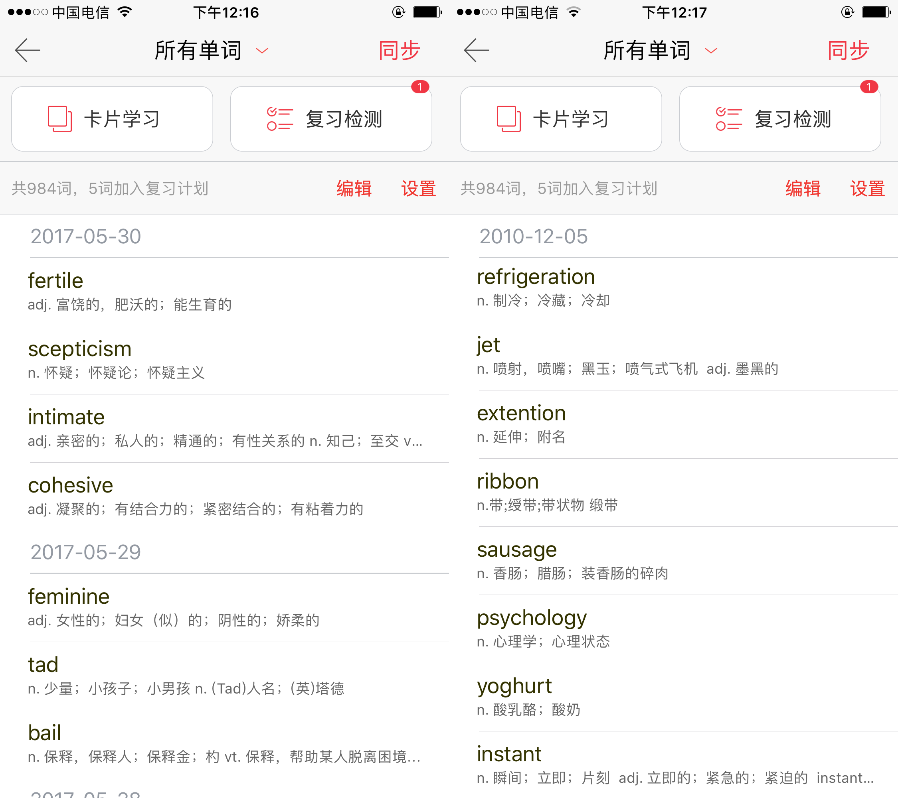

# Vocabulary

## Vocabulary
Từ ngữ là các khối xây dựng của một ngôn ngữ. Khi học một ngôn ngữ, bạn phải bắt đầu từ những điều cơ bản. Nếu không có những điều cơ bản, bạn không thể học tốt hơn, nhanh hơn và dễ dàng hơn.
Nếu bạn muốn bỏ qua các từ để học, bạn sẽ dành (chính xác hơn là **lãng phí**) nhiều thời gian hơn cho việc học sau này. Từng bước một là một cách học tiếng Anh tốt.
**Từ vựng có đặc điểm nổi bật là thay đổi từ định lượng sang định tính, khi số lượng từ bạn nắm vững đạt đến mức đầu nguồn, bạn sẽ thấy việc học tiếng Anh trở nên cực kỳ dễ dàng.
Nhờ sự trợ giúp của ngữ cảnh, bạn có thể suy ra nghĩa của hầu hết các từ mới, từ đó bạn có thể sử dụng các tài liệu học tiếng Anh gốc tốt hơn để việc học tiếng Anh trở nên hiệu quả hơn, chẳng hạn như: The Economist, sách tiếng Anh gốc**.
Đầu tiên, chúng ta hãy xem sự phân bố của các từ tiếng Anh:

>Hình ảnh gốc được lấy từ Oxford English Corpus（OEC），tôi đã sử dụng Sketch để so sánh，file sketch nằm trong thư mục assets của repo

Thông điệp đơn giản có thể được rút ra từ bức tranh này là:
- 1000 từ vựng có thể giúp bạn hiểu được khoảng 75% nội dung tiếng Anh
- 7.000 từ vựng là một bước ngoặt quan trọng (Thật thú vị khi hiểu được gần 90% nội dung chỉ với 7.000 từ phải không?)
- Hiệu quả ghi nhớ từ ngày càng giảm

Sau đó hãy đặt mục tiêu nhỏ trước: thử 7.000 từ trước. Tách nó ra, 40 miếng mỗi ngày, chỉ mất 175 ngày trong điều kiện lý tưởng mà không quên!

### Thị giác và Thính giác
Trước khi bạn bắt đầu mở rộng vốn từ vựng của mình, tôi hy vọng bạn sẽ dành chút thời gian để hiểu đặc điểm học tập của chính mình. Người học bằng thị giác và người học bằng thính giác có những cách tiếp cận khá khác nhau trong việc học tiếng Anh.
Người học bằng hình ảnh ghi nhớ các từ bằng cách *hình dung* các từ, chẳng hạn như liên kết các từ bằng *hình ảnh/video* hoặc thậm chí coi chính các từ đó như một *biểu tượng/đồ họa trực quan*. Một số người học bằng hình ảnh Người đọc có thể nhớ các từ bằng cách viết chúng thành nhiều chữ lần.
Thị giác có tác dụng kỳ diệu trong việc tăng cường trí nhớ của con người nhưng nó cũng có những tác động tiêu cực nhất định.
Điều này thể hiện ở chỗ khi bạn nhìn thấy một hình ảnh nào đó, bạn có thể nhanh chóng liên tưởng đến một từ nào đó, nhưng khi tách rời khỏi hình ảnh đó, bạn lại không biết từ đó có nghĩa là gì.
(Phần lớn các phần mềm ghi nhớ từ đều sử dụng thẻ hình. Khi xem lại các hình ảnh mà phần mềm đưa ra, bạn sẽ nghĩ rằng mình đã nhớ được từ đó. Tuy nhiên, tình hình thực tế là bạn đã nhớ được hình ảnh. Điều này có cũng là mối quan hệ ánh xạ giữa hình ảnh và từ ngữ. Bạn tập trung quá nhiều vào hình ảnh mà bỏ qua những từ ngữ mà bản thân hình ảnh muốn diễn đạt.)
Gợi ý tôi muốn đưa ra là khi ghi nhớ từ một cách trực quan, bạn nên sử dụng phương pháp *abstract* để trừu tượng hóa những thông tin trực quan tương ứng với từ đó thành nội dung mà bạn có thể hiểu được.
Ví dụ:'cat' => “mèo”; phần mềm word sẽ cung cấp cho bạn một hình ảnh cụ thể về một con mèo, chẳng hạn như

Nhưng đây có thể không phải là con mèo mà bạn hiểu, vì trên thực tế, có một hình ảnh trừu tượng trong tâm trí bạn đại diện cho một con mèo, có thể trông như thế này:

Nó cũng có thể trông như thế này:

Nó cũng có thể trông như thế này:

Nó cũng có thể trông như thế này:

Hoặc thậm chí một cái gì đó như thế này (có thể là hình ảnh bạn có thể vẽ bằng tay):

Tất nhiên là cũng có thể:

Hình dung các từ theo cách *trừu tượng* có thể giúp bạn kết nối các từ với nghĩa của chúng tốt hơn.

---
Người học bằng thính giác có lợi thế tự nhiên khi học ngôn ngữ. Học bằng cách *nghe* nhiều sẽ gần với việc học ngôn ngữ tự nhiên hơn. Nếu bạn nhận thấy mình là người học bằng thính giác thì bạn thật may mắn, bạn sẽ có thời gian học tiếng Anh dễ dàng hơn rất nhiều so với người bình thường.
Tuy nhiên, hầu hết người học bằng thính giác đều chưa hiểu đúng phương pháp học tập bằng thính giác, đến khi nhận ra mình là người học bằng thính giác thì có thể họ đã hình thành thói quen học tập bằng thị giác.
Những người học bằng thính giác phải thành thạo *phát âm* nếu muốn tận dụng điểm mạnh của mình. Khi bạn đã có nền tảng *phát âm* tốt, bạn có thể chuyển hầu hết những gì bạn nghe được thành các từ viết đúng chính tả, sau đó khiến việc học tiếng Anh trở nên hiệu quả hơn nữa với nội dung ngữ âm thú vị.
Vì vậy, nếu bạn cho rằng mình có thể là người học bằng thính giác, hãy nhớ đừng bỏ lỡ phần *Phát âm* và *Nghe* của hướng dẫn này.

Dù bạn là người học bằng thính giác hay thị giác, khi học từ, nếu có điều kiện hãy nhớ sử dụng từ điển để nghe cách phát âm của từ đó nhé!
>Việc phát âm kém các từ trong nhiều video dạy kỹ thuật ở Trung Quốc thực sự đáng xấu hổ. Trên thực tế, trên Internet tràn ngập một số lượng lớn các video dạy miễn phí, tồn tại dưới dạng tiếng Anh. Giảng viên có trình độ cao, cách phát âm chính xác, nội dung giảng dạy phù hợp với Bắt kịp thời đại.

Thầy Ronnie có video dạy ghi nhớ từ，[Link YouTube](https://www.youtube.com/watch?v=JuoqE2lpRUM) | [Link Youku](http://v.youku.com/v_show/id_XMjgyMDQyMDgzNg==.html)

### Hai cách để ghi nhớ từ
#### Loại đầu tiên là niệm một lượng thích hợp mỗi ngày
##### lợi thế:
- Phân bổ thời gian linh hoạt và thời gian làm việc ngắn (thích hợp sử dụng thời gian rải rác như thời gian đi tàu điện ngầm và trước khi đi ngủ)
- Gánh nhẹ
- Ít bị thất vọng hơn
- Thích hợp cho việc học từ vựng cốt lõi
##### sự thiếu sót:
Vì **tỷ lệ ghi nhớ từ đang giảm dần và thường không có phản hồi tích cực hiệu quả** nên tình hình thực tế thường là bỏ cuộc sau khi ghi nhớ 800 từ, bỏ cuộc sau khi ghi nhớ 1000 từ và bỏ cuộc sau khi ghi nhớ 1001 từ. từ.

#### Loại thứ hai là nhập quá mức
Bằng cách đọc thuộc lòng nhiều từ và ôn lại nhanh chóng, mặc dù tỷ lệ quên cao hơn so với việc đọc thuộc lòng số lượng nhưng số lượng có thể giành chiến thắng.
Ví dụ: mỗi ngày bạn ghi nhớ 20 từ thì một tháng bạn có thể ghi nhớ 600 từ, nếu 80% số từ được hình thành vào trí nhớ dài hạn thì con số cuối cùng có thể nhớ được là 480.
Nhưng nếu tôi sử dụng cùng một khoảng thời gian và đọc nhanh 100 từ mỗi ngày, tôi có thể đọc được 3.000 từ trong một tháng. Giả sử bạn có thể nhớ được 30% thì cuối cùng bạn cũng có thể nhớ được 900, con số này lớn hơn nhiều so với phương pháp đầu tiên.
Nó phù hợp cho giai đoạn học từ vựng 1000 ~ 7000.
>Khi vốn từ vựng của bạn vượt quá 7.000, bạn nên có kỹ năng học 'từ mới' thông qua hình thái và ngữ cảnh. Phương pháp cụ thể sẽ được giải thích chi tiết ở các chương tiếp theo.
Việc áp dụng cụ thể hai phương pháp này cần được xác định theo thói quen học tập của cá nhân.

### Mẹo ghi nhớ từ
- Lặp lại, lặp lại, lặp lại (không có gì khác ngoài sự quen thuộc)
- Sử dụng những ghi chú nhỏ và những tờ ghi chú dán (đặt những từ này ở nơi bạn có thể nhìn thấy chúng thường xuyên và thỉnh thoảng nhìn vào chúng)
- Tạo thẻ hình ảnh (bạn có thể vẽ một con chó đơn giản)
- Ghép từ và đặt câu (ngữ cảnh không chỉ giúp bạn ghi nhớ mà còn giúp bạn dùng từ tốt hơn)
- **Đọc to** (hãy nhớ Crazy English của Mouyang)
- Cho một số từ **ý nghĩa đặc biệt** (chẳng hạn như machine learning, lập trình, bạn gái, v.v.)

### Đường cong ký ức Ebbinghaus
Chu kỳ trí nhớ của con người được chia thành trí nhớ ngắn hạn và trí nhớ dài hạn, việc ghi nhớ một từ có nghĩa là hình thành trí nhớ dài hạn.
đường cong quên lãng（Forgetting curve）Đó là một đường cong dùng để biểu thị tốc độ quên của trí nhớ trung và dài hạn trong trí nhớ.
Đường cong này lần đầu tiên được nhà tâm lý học Hermann Ebbinghaus đề xuất thông qua các thí nghiệm của chính ông. Trong thí nghiệm này, Ebbinghaus đã sử dụng một số tổ hợp chữ cái vô nghĩa. Đường cong này được tạo ra bằng cách ghi nhớ các tổ hợp chữ cái này và kiểm tra tốc độ quên sau một loạt khoảng thời gian.
Vì vậy đường cong này còn được gọi là[Đường cong quên lãng Ebbinghaus](https://zh.wikipedia.org/wiki/%E9%81%97%E5%BF%98%E6%9B%B2%E7%BA%BF)。

Đường cong này cho thấy quá trình quên không đồng đều, lúc đầu ghi nhớ tốc độ quên rất nhanh, sau đó chậm dần, sau một thời gian nhất định, việc quên gần như không còn quên nữa, tức là quá trình quên phát triển. là "lúc đầu nhanh và sau đó chậm".
Quá trình quên không chỉ bị hạn chế bởi yếu tố thời gian mà còn bởi các yếu tố khác. Điều đầu tiên học sinh quên là những tài liệu không quan trọng, không hứng thú và không cần thiết. Cái không quen thuộc sẽ bị lãng quên sớm hơn cái quen thuộc. Nói chung, sau khi ghi nhớ, hãy lặp lại sau 5 phút, lặp lại sau 20 phút, 1 giờ sau, 12 giờ sau, 1 ngày sau, 2 ngày sau, 5 ngày sau, 8 ngày sau, 14 ngày sau, và bạn sẽ nhớ nó rất chắc chắn:
#### Trước tiên hãy coi tỷ lệ từ là một cặp *khóa-giá trị* đơn giản
'Từ tiếng Anh'=>'nghĩa tiếng Trung tương ứng (thường là một mảng)', hãy cố gắng ghi nhớ trực tiếp các cặp khóa-giá trị như vậy:
- Chu kỳ ghi nhớ đầu tiên là 5 phút (cố gắng dành 5 phút buổi sáng để học 10 từ mới)
- Chu kỳ ghi nhớ thứ 2 là 30 phút (sau nửa giờ, đầu tiên dành 5 phút để ôn lại 10 từ mới vừa học, sau đó dành thêm 5 phút để học 10 từ mới)
- Chu kỳ ghi nhớ thứ 3 là 12 tiếng (dành khoảng 15 phút trước khi đi ngủ để ôn lại 20 từ đã học hôm nay)
>Ba chu kỳ trí nhớ này thuộc loại trí nhớ ngắn hạn (thời gian dành cho việc học và ôn tập chỉ là giá trị gần đúng, vui lòng điều chỉnh theo thói quen của bản thân)

>Sau đây là các chu kỳ quan trọng:
- Kỳ nhớ thứ 4 là 1 ngày
- Kỳ nhớ thứ 5 là 2 ngày
- Thời gian ghi nhớ thứ sáu là 4 ngày
- Kỳ nhớ thứ bảy là 7 ngày
- Thời gian ghi nhớ thứ 8 là 15 ngày

8 chu trình trên được sử dụng để ghi nhớ từ, là 8 điểm ôn tập của một chu trình ghi nhớ từ lớn, có thể phát huy tối đa hiệu quả ghi nhớ từ. Vì vậy, hãy lập kế hoạch ghi nhớ và sử dụng các quy luật của đường cong trí nhớ để ôn lại các từ để hình thành trí nhớ dài hạn. Hãy dùng thử trong 14 ngày, tôi nghĩ kết quả sẽ làm bạn ngạc nhiên.

#### Để tôi cho bạn một ví dụ từ kinh nghiệm cá nhân của tôi:
Phương pháp cụ thể ở trường cấp 3 là: vì lúc đó nhà trường phát chung 10 cuốn sách nên tôi dành khoảng 3 lớp để ôn lại tất cả các từ trong 10 cuốn này, sau đó chép lại tất cả những từ mà tôi không nhớ được, xuống.
Sau đó tôi có một cuốn sách từ vựng, và từ đó tôi thường đọc cuốn sách từ vựng đó.
Mỗi lần ôn lại, nếu bạn chắc chắn rằng mình đã nắm vững một từ nào đó và hình thành trí nhớ lâu dài thì hãy gạch bỏ từ đó trong sổ từ vựng.
Bạn thậm chí có thể tạo một số dấu gần từ đó, chẳng hạn như sử dụng hình tam giác để thể hiện "Đây là một từ thú vị", một vòng tròn để thể hiện "Đây là từ một cuốn sách hoặc video tôi đọc gần đây" và biểu tượng tai để thể hiện "Tôi tôi không chắc về cách phát âm". chờ đã:

Tôi vẫn giữ thói quen này cho đến ngày nay (từ tháng 12 năm 2010), nhưng tôi không còn dùng sổ giấy nữa mà đồng bộ nó với phần mềm từ điển, tra cứu hàng ngày trong giờ nghỉ trưa và sau khi tập thể dục buổi tối.
Mình sử dụng kết hợp 2 phương pháp ghi nhớ từ đã giới thiệu ở trên, vì khi cuốn từ vựng của bạn đạt 500 từ trở lên, bạn cần ôn lại càng nhiều từ càng tốt.
Nếu không, hãy chuẩn bị hai cuốn từ điển và đọc chúng thường xuyên.

>Việc mang theo một cuốn từ điển nặng là vô cùng bất tiện, vì vậy tốt hơn hết bạn nên chuẩn bị cho mình một bộ phần mềm từ điển tiện lợi.
  Hai cuốn từ điển trong hình đã bị hỏng sau một thời gian dài sử dụng.

## Sử dụng từ điển từ trên đám mây

**Chức năng của sách từ vựng đám mây là quản lý tập trung các từ mới để ôn tập bất cứ lúc nào!**

Bất kể bạn gặp từ mới ở đâu, hãy nhớ đưa chúng vào một cuốn sách từ vựng có thể được đồng bộ hóa trên nhiều thiết bị đầu cuối, nếu không, bạn sẽ tìm thấy những từ mới mà bạn gặp sau này ở đâu?
Về việc sử dụng phần mềm từ điển nào thì tôi sẽ không quảng cáo, miễn là ứng dụng có tính năng đồng bộ đa đầu thì tôi cũng như vậy. Đăng ảnh chụp màn hình:

Bạn có thể thấy rằng ngay cả khi bạn đã ôn lại một số từ trong 7 năm, bạn vẫn không chắc mình đã nhớ hết chúng.
#### Coi các từ là *đối tượng*
>Nếu bạn không hiểu khái niệm *hướng đối tượng*, bạn có thể chọn bỏ qua phần này hoặc tìm hiểu về các khái niệm liên quan trước

Bạn có thể thấy rằng một số từ có được bằng cách "thay đổi các quy tắc cụ thể" trên một số "từ cơ bản", tương tự như ý tưởng lập trình hướng đối tượng.
Chúng ta có thể coi đặc điểm này là “kế thừa” và “đa hình”, thì điều chúng ta cần học thực chất là *phương pháp mở rộng*, thay vì đọc thuộc lòng những từ đã thay đổi này thành từ mới.
>Học từ và ghi nhớ từ không tương đương nhau, điều đó có nghĩa là chúng ta có thể sử dụng các phương pháp tốt hơn để học từ

## Phần mềm ghi nhớ từ Anki
[Anki là một ứng dụng ghi nhớ từ đa nền tảng](https://apps.ankiweb.net/), Anki giúp việc ghi nhớ trở nên dễ dàng hơn. Đây có thể là một phương pháp ghi nhớ tùy chỉnh và đa chức năng để giảm thời gian học tập và nâng cao năng lực học tập của bạn và nâng cao hiệu quả học tập.

Để giúp mọi người ghi nhớ từ vựng tần số cao dễ dàng hơn, mình xin chia sẻ thẻ Anki "Macmillan 7000 Vocabulary" (cảm ơn Simon đã tối ưu hóa), các tính năng như sau:
- Thêm ký hiệu ngữ âm
- Thêm câu ví dụ
- thêm hình ảnh
- Thêm bản dịch câu ví dụ

Liên kết: https://pan.baidu.com/s/1i5OLIIT Mật khẩu: jm4k

Vì gói thẻ trên đã được sản xuất từ lâu nên sẽ xuất hiện trên một số nền tảng di động [#76](https://github.com/byoungd/English-level-up-tips-for- Chinese/issues/76) sẽ xảy ra trên một số gói thẻ. nền tảng di động. Bản cập nhật như sau:

- Sửa đổi kiểu thẻ từ, giảm cỡ chữ, điều chỉnh thứ tự các ô đáp án ở mặt sau, v.v. để thích ứng với ứng dụng di động
- Ngoại tuyến tất cả hình ảnh và các tài nguyên khác thông qua plugin [Bản địa hóa phương tiện](https://ankiweb.net/shared/info/1293255374).

   > [Macmillan7000_a-n.apkg](../assets/麦克米伦7000_imagefix_a-n.apkg)  
   > [Macmillan7000_o-z.apkg](../assets/麦克米伦7000_imagefix_o-z.apkg)

## Sách từ vựng được đề xuất
- 
- 
- 
  
   Cuốn sách này phù hợp với những người có nền tảng từ vựng nhất định (khoảng 7.000), cũng là cuốn từ vựng được khuyên dùng thường xuyên khi luyện thi TOEFL và GRE, thường được gọi là Webster's Little Green Book.
   Trong suy nghĩ của nhiều người, Webster's Little Green Book tưởng chừng như là một cuốn sách ghi nhớ các phụ tố gốc, nhưng giá trị thực sự của cuốn sách này không nằm ở chỗ.
   Mặc dù cuốn sách Little Green Book của Webster cung cấp 250 gốc từ nhưng những gốc này không có giá trị thực tiễn lớn.
   Ưu điểm lớn nhất của cuốn sách này là cung cấp phương pháp ghi nhớ từ thông qua ngữ cảnh.
   Bộ não con người không giỏi ghi nhớ những thứ rời rạc, không có sự liên kết logic, chỉ có cách đặt từ ngữ vào ngữ cảnh cụ thể thì chúng ta mới có thể hiểu và sử dụng được chúng.
   Bám sát ý tưởng này, cách giải thích từ ngữ trong Little Green Book của Webster được chia thành ba phần: định nghĩa tiếng Anh, câu ví dụ và phần giải thích từ ngữ được cá nhân hóa của tác giả.
   Ngoài những cách diễn giải từ độc đáo, Little Green Book của Webster đã sắp xếp một số lượng lớn các câu hỏi kiểm tra củng cố và những bài kiểm tra này không chỉ kiểm tra nghĩa của từ mà còn kiểm tra cách sử dụng cụ thể của từ trong ngữ cảnh và cách hiểu các từ tương tự. lời nói.Phân tích.
   Tôi hy vọng bạn không bỏ lỡ cuốn sách nhỏ màu xanh này khi bạn đã có vốn từ vựng nhất định.

>Khi ghi nhớ từ, hầu hết bạn không cần phải cố gắng ghi nhớ mà chỉ cần lướt qua một lúc thôi.Từ mới, **từ mới**, nhiều từ quá sẽ quen thôi một cách tự nhiên.

Bài tiếp theo: [Listening](3-listening.md)
