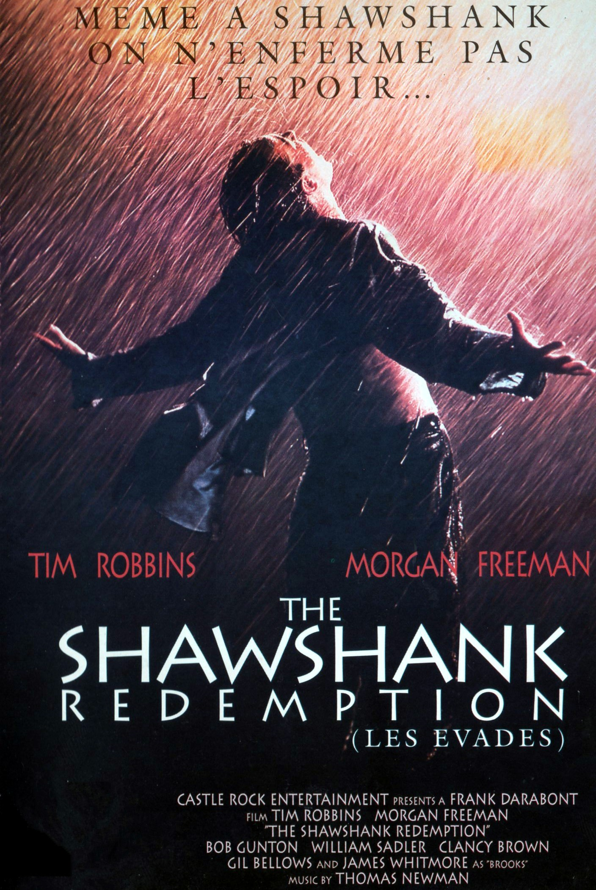

# 听力篇

> 推荐的视频大多数是 YouTube 上的，通常这些视频都有准确度相当高的英语字幕（绝大多数为自动生成），由于 GFW 的原因，你需要通过**科学**上网来访问。

## 练习英语听力的几个误区

- **学习材料分散**

  订阅过多的听力内容，VOA、BBC、各种 Podcast、英文名篇朗读等，导致无法稳定地每天都分配时间去听；
  今天听一篇 VOA，隔天听一篇 BBC，过两天再翻翻哪个 YouTube 频道，这种毫无计划地练习听力效率并不高；
  VOA、BBC 还有很多优秀的 Podcast 都是很棒的学习材料，选择最感兴趣的，评估自己的学习时间，订阅适量的内容。

- **学习材料超纲**

  很多人一开始就尝试 VOA，这是不推荐的；即使是 VOA 慢速英语，你也会遇到生词太多导致卡住、丧失继续听下去的兴趣的情况；
  有些喜欢钻牛角尖的同学会问：听一遍没听懂，那我听 10 遍呢？
  事实上如果你不去通过听力材料提供的文本将生词这关先过了，听 100 遍也是收效甚微的。这与我们提倡的高效学习相悖。
  英美剧对初学者来说就更不是 **友好** 的学习材料，根据自己的词汇量选择合适的听力材料，一步步来，循序渐进。

- **过度依赖字幕**

  喜欢刷英美剧的同学很可能产生一种错觉，边看双语字幕边听，误以为自己可以听懂绝大部分内容。
  试着把字幕关闭，再看看。即使是二刷，我想你也会遗漏掉很多信息。
  那么，是不是在看英美剧的时候不看字幕就能提高听力呢？答案是否定的，因为往往会违反了上一条 **学习材料超纲**，影视剧里的生词是较多的。
  当你二刷、三刷一部喜欢的影片时，推荐关掉字幕，借助之前记忆的部分内容，会有助于你提高听力。

- **选择不感兴趣的材料**

  听力材料再优秀，如果你丝毫提不起兴趣，也会成为一件苦差事，我不会劝你试着去喜欢你已经证实不会喜欢的东西。
  要知道，现在的听力材料之丰富，远超我们的想象，找到质量上乘又有趣的内容不是非常困难。
  而且基于激励机制，我们可以选择对 工作、生活、情感、健身 等方面有帮助的学习材料，从而激发自己的学习兴趣。

- **无意识的听**

  大家听英文歌的时间应该不算少，可是很少有人有意识的去听歌词的内容，浪费掉了很多提高听力的机会。
  无论是流行英文歌还是经典金曲，歌词创作的一般都相当优美。
  如果你肯花一定的时间去了解歌词的内容，并在听音乐的时候，有意识的去识别所唱的内容，久而久之会对提高英语听力有着巨大帮助。

  > 有的时候你应该选择沉浸在优美的旋律里面而不是过分关注表达的内容，无时无刻都在学习在一定程度上很可能会降低生活幸福指数

## 精听与泛听

### 精听

先把听力材料听明白，听懂表达的意思，然后把争取每一个单词都听清楚。精听一般会配合拼写或者用口语重复进行练习。
听第一遍的时候记不住、跟不上、很多单词没有听清都是很正常的，多听几次就会有显著提高了。
精听还可以帮助自己学习单词发音、连读、断句等。分析自己在听力方面的弱项，针对性的去锻炼。
我高中时采用了很笨的方法：反复听，直到自己可以背诵、拼写整篇文章，花了大量的时间与精力去听新概念第三册，那时并没有看出对自己的英语水平有多少提升，甚至一度怀疑自己在做无用功，直到高考成绩是 115 分（满分 120）才明白受益良多。
听力材料可选的非常多，在这里我先简单的推荐《新概念英语》第三册和第四册。

### 泛听

泛听是为了帮助我们更为自然地接触英语，用于培养英语语感，目的在于在听力练习中以掌握文章的整体意思，了解地道英语。
对词汇量的提升、口语也有明显的帮助。有声书、电影、电视剧、音乐等都是泛听的好材料。

#### 有声书

很多英文经典名著和畅销书都推出了相应的有声书版本，比如 Gone with the wind, The Kite Runner, Pride and Prejudice,The Great Gatsby 等。
英文有声书的朗读者大都是专业的播音员或者演员出身，声线优美，朗读时的表现力很强，一定程度上让听有声书成为了一种享受，学习效果自然会好很多。

- [audible](http://www.audible.com/) 网站资源丰富，有对应的移动端 app，挺好用的，推荐。

- 国内某些 FM 有不错的有声书可以听。

#### 电视剧

《老友记》是口碑上乘的佳作，是学习的经典材料。
在这里我推荐另一部剧《摩登家庭》，这是我个人非常喜欢的一部喜剧，多次获得艾美奖最佳喜剧。同时本剧的台词相当有水平，是学习与欣赏的极佳材料。
神剧《风骚律师》也是非常非常棒的选择，但是对英语水平的要求要明显高于《老友记》和《摩登家庭》。

> 《摩登家庭》第一季拍摄于 2009 年，我周围人的生活到现在也没有**摩登**到 2009 年的《摩登家庭》

#### 电影

优秀的电影非常适合泛听，尤其是经典高分电影。可以参考[豆瓣高分电影榜单](https://movie.douban.com/top250)。
我刷了 10 遍+的影片（影片的选择请根据自己的喜好，我列举的仅代表个人喜好）：

-《怦然心动》
-《教父123》
-《机器人总动员》
-《控方证人》
-《桃色公寓》
-《星际穿越》
-《美丽人生》

> 通过电影、美剧等学习英语真的需要良好的基础，而且这部分的学习效果更多的是来自于享受电影、电视剧的额外收益。
> Podcast 和带 lrc 的美剧录音比纯看美剧要少很多干扰，在同时摄入的信息量上减少了视觉信息这部分，学习效果更好。

#### 音乐

欧美金曲值得推荐的实在太多，无法一一列举：
- 受欢迎的歌手：贾斯汀·比伯、戳爷、水果姐、霉霉、盆栽精、打雷、Ed Sheeran, Adele, Maroon 5, Bilie Eilish, Sam Smith 等等
- iTunes 榜
- BillBoard
- UK 榜

#### 直播

如果你喜欢看直播，去[Twitch](https://www.twitch.tv/)上找找喜欢的主播吧。

## 入门听力训练

- [Basic English Grammar](https://www.youtube.com/watch?v=Rp3LqMYBhkQ&list=PL2621D8F6B6B29B7B)
  这是一个非常适合初学者的听力入门学习材料,主要讲解一些基础语法，但是内容非常简单，同时介绍很多基础词汇，语速适中正是初学者需要掌握的。

- [Learn English with Valen - Basic English lessons by ValenESL](https://www.youtube.com/channel/UCgzuT-fpJiyThTUlMiFRCKQ)
  内容大多数为很基础的英语语法、一些词汇的用法等，非常适合初学者。虽然视频内容较旧，作者停止了更新，但是依然是非常棒的初学者教程。

## 优秀的英语学习材料推荐

### 编程相关

- [laracasts](https://laracasts.com/)
  推荐指数：5

这是一个关于前端和 PHP 框架 Laravel 的视频教程网站，内容更新及时，讲解细致，大部分内容免费，对刚入门的程序员很友好。
教程内容涉及 JavaSrcipt/Vue.js/React/Laravel/PHP/编辑器的进阶教程等。
很喜欢他的那句口头禅 _Does it make sense to you?_

- [LearnCode.academy](https://www.youtube.com/channel/UCVTlvUkGslCV_h-nSAId8Sw)
  推荐指数：5

如果你想学习 React/Redux/MobX/AngularJS/NodeJS/Docker 等，这里会是你愿意花很多时间待的地方

- [Traversy Media](https://www.youtube.com/channel/UC29ju8bIPH5as8OGnQzwJyA)
  推荐指数：5

也是关于前端的一个很棒的频道，作者是个可爱的大胖子，内容覆盖面广，更新及时。作者发音较为标准，且速度较慢，新手也不会觉得吃力。

- [Derek Banas](https://www.youtube.com/channel/UCwRXb5dUK4cvsHbx-rGzSgw)
  推荐指数：4

Derek 制作的 _一个视频学习一门语言_ 的教程系列可以帮助你快速了解一些流行编程语言的基础语法,不过单位时间内包含的信息量大且语速稍快，适合有一定基础的同学。

- [The Net Ninja 10](https://www.youtube.com/channel/UCW5YeuERMmlnqo4oq8vwUpg)
  推荐指数：4

前端学习很棒的一个频道，较早的内容开头的忍者语音有点吓人，近期的视频开头已经替换为相对友好的提示音。该频道 CSS/Sass 相关的教程值得推荐。

- [DevTips](https://www.youtube.com/channel/UCyIe-61Y8C4_o-zZCtO4ETQ)
  推荐指数：4

这是一个对刚入门的前端程序员友好的频道，细致的基础内容，CSS、JQuery 相关的内容值得推荐。

- [egghead.io](https://egghead.io/)
  推荐指数：4

拥有较为丰富的前端课程，小部分免费。

### YouTube 频道推荐

- [EnglishLessons4U - Learn English with Ronnie! [engVid]](https://www.youtube.com/user/EnglishLessons4U)

  **力荐** 学习英语的基础语法，很多小技巧都挺实用。最最重要的是，Ronnie 老师实在是太幽默啦，学习的过程中你会感受到快乐！

- [English with Lucy!](https://www.youtube.com/channel/UCz4tgANd4yy8Oe0iXCdSWfA)

  妹纸很漂亮，和我当年的大学英语老师有的一拼。

- [EnglishAnyone](https://www.youtube.com/channel/UCrJHj7MDQhmQ9iFuACdoWCg)

  教你说流利英语,因为作者的发音清晰、标准，设计的内容也比较贴近日常生活，是练习听力很棒的频道

- [Speak English With Vanessa](https://www.youtube.com/channel/UCxJGMJbjokfnr2-s4_RXPxQ)

  Vanessa 老师给人一种热情、乐观的感觉，发音标准，声情并茂。

- [mmmEnglish](https://www.youtube.com/channel/UCrRiVfHqBIIvSgKmgnSY66g/)

  Emma 老师的发音柔软清透、温和迷人。

- [English Fluency Journey](https://www.youtube.com/channel/UC9eIq7PwD0WA-2B_Sp7xGdw)

  跟着 Anna 老师学习对话，受益良多。

### 超级英雄电影爱好者不该错过的频道

- [TopMovieClip](https://www.youtube.com/channel/UClVbhSLxwws-KSsPKz135bw)
  漫威超级英雄电影精彩剪辑，很养眼。

- [BestClips 4](https://www.youtube.com/channel/UC8BQGqcCSFq6RC9feEGUGFA)
  超级英雄电影相关

### 脱口秀类节目

- [Jimmy Kimmel Live](https://www.youtube.com/channel/UCa6vGFO9ty8v5KZJXQxdhaw)
  鸡毛秀

- [TheEllenShow](https://www.youtube.com/channel/UCp0hYYBW6IMayGgR-WeoCvQ)
  艾伦秀

- [The Late Show with Stephen Colbert](https://www.youtube.com/channel/UCMtFAi84ehTSYSE9XoHefig)
  Late 秀

### 音乐频道  

- [Valerie Pola](https://www.youtube.com/watch?v=mwfg8YmZM3E)

- [Luciana Zogbi](https://www.youtube.com/watch?v=39_OmBO9jVg)

- [Sara Farell](https://www.youtube.com/watch?v=2jZFsQS8Veo)

- [JFla](https://www.youtube.com/watch?v=MhQKe-aERsU)

- [Boyce Avenue](https://www.youtube.com/watch?v=HcQJzFzZfVI)

- [xooos](https://www.youtube.com/c/xooos)

- [Hailee Steinfeld](https://www.youtube.com/channel/UCWfytcGFwPSMwvP5HYuXGqw)

### 其他

- [Disney UK](https://www.youtube.com/user/WaltDisneyStudiosUK)
  冰雪奇缘主题曲 FROZEN 的播放量高达 10 亿+!
- [Vevo](https://www.youtube.com/user/VEVO)
  电影级 MV 的集中营呀,VEVO 旗下有很多视频都有单独的频道，请自行查找感兴趣的
- [OneDirectionVEVO](https://www.youtube.com/user/OneDirectionVEVO)
  OneDirection 粉应该关注的频道
- [SiaVEVO](https://www.youtube.com/channel/UCmKdSrwf1e8coqAzUsrVHZw)
  个人非常喜欢，视频质量感人，引人深思
- [SSSniperWolf](https://www.youtube.com/channel/UCpB959t8iPrxQWj7G6n0ctQ)
  一只可爱的妹子。
- [TED 6](https://www.youtube.com/channel/UCAuUUnT6oDeKwE6v1NGQxug)
  TED Talks,听听别人的 idea 是一件很有意思的事情，建议从热门的开始看，TED Talks 的热门视频往往都有多国语言字幕。

## 单独推荐的 YouTube 视频

- [自信的技巧 - 伊万•约瑟夫博士 - TEDxRyersonU](https://www.youtube.com/watch?v=w-HYZv6HzAs) | [优酷链接](http://v.youku.com/v_show/id_XMjgyMDQwMDc4MA==.html)
- [说流利英语的一个小技巧](https://www.youtube.com/watch?v=l96V7dQtq9E) | [优酷链接](http://v.youku.com/v_show/id_XMjc2MzE0NTQ4NA==.html)
- [朱利安·特瑞雪: 怎样说话人们才会听](https://www.youtube.com/watch?v=eIho2S0ZahI) | [B 站链接](http://www.bilibili.com/video/av2915315/)
- [Sia - Chandelier (Official Video)](https://www.youtube.com/watch?v=2vjPBrBU-TM) | [优酷链接](http://v.youku.com/v_show/id_XMjgyMDQxMjMwNA==.html)

下一篇：[阅读篇](4-reading.md)
